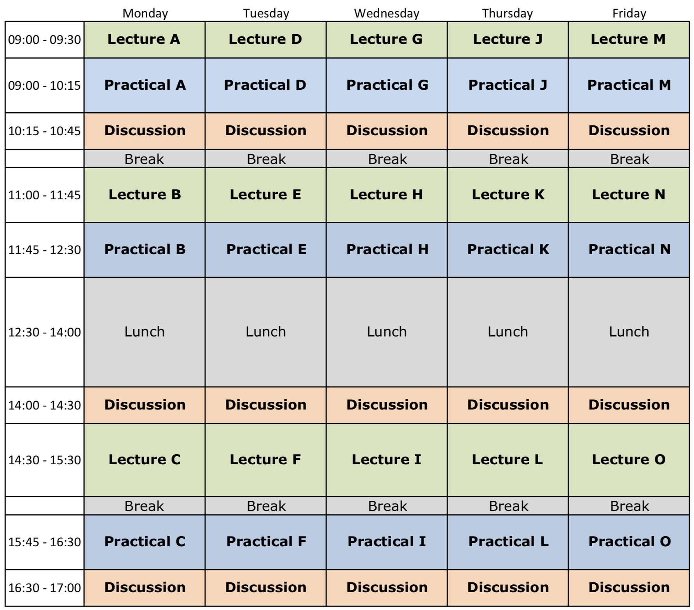
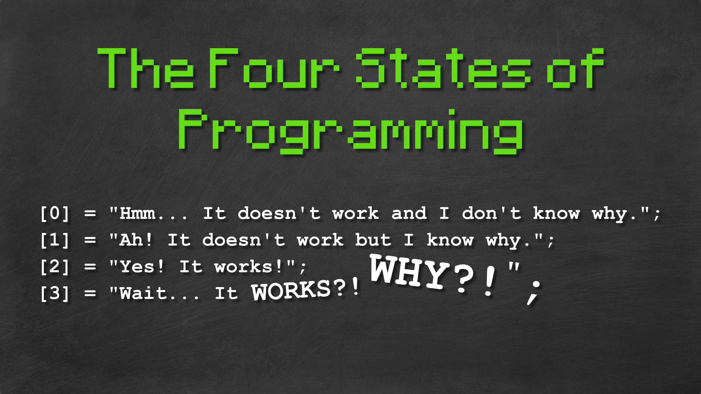
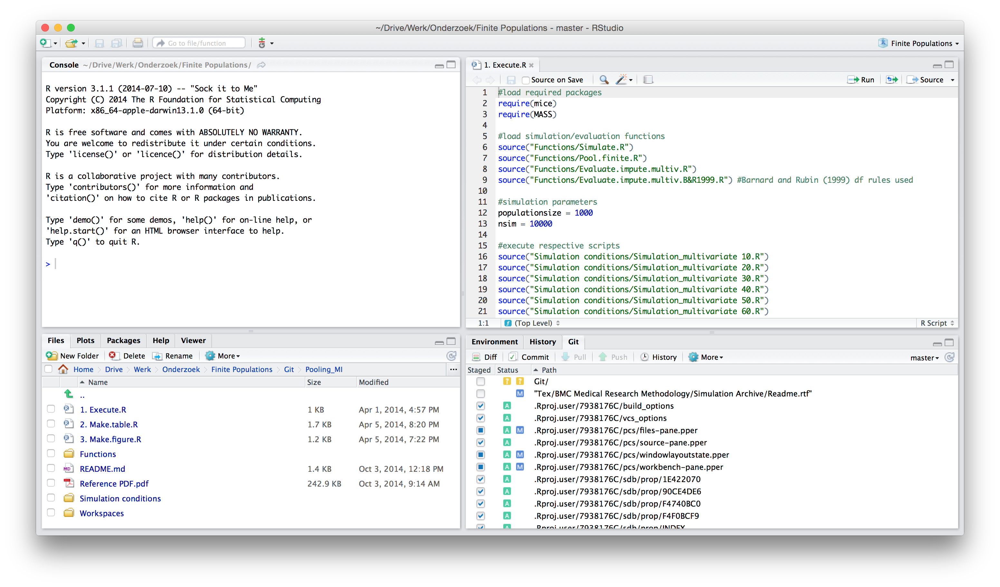
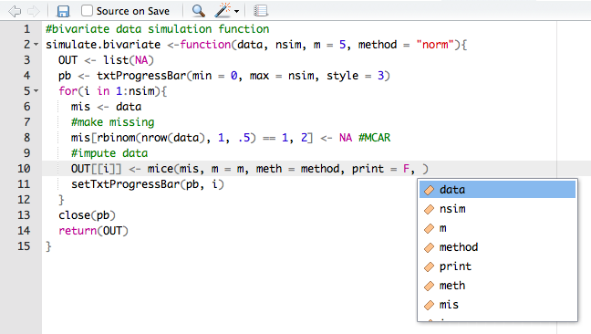

## Very useful
You can access the course materials quickly from

[www.gerkovink.com/R](https://www.gerkovink.com/R)


Some guidelines

1. Please keep your microphone off
2. If you have a question, raise your hand or type your question in the chat
3. You may always interrupt me 
4. We will introduce frequent question breaks


# Overview of this course
## Program
<center>

</center>

# Goal of this course
## Learn to keep your *cool*
<center>
  
</center>

and build the foundation for a succesfull scripting career

# What is R?

## Software
<center>

</center>

## The origin of R
- R is a language and environment for statistical computing and for graphics

- GNU project (100% free software)

- Managed by the R Foundation for Statistical Computing, Vienna, Austria.

- Community-driven

- Based on the object-oriented language S (1975)

# What is RStudio?

## Integrated Development Environment
<center>

</center>

## RStudio
- Aggregates all convenient information and procedures into one single place
- Allows you to work in projects
- Manages your code with highlighting
- Gives extra functionality (Shiny, knitr, markdown, LaTeX)
- Allows for integration with version control routines, such as Git.

# How does R work

## Objects and elements
- R works with objects that consist of elements. The smallest elements are numbers and characters.

    - These elements are assigned to objects. 
    - A set of objects can be used to perform calculations
    - Calculations can be presented as functions
    - Functions are used to perform calculations and return new objects, containing calculated (or estimated) elements. 

## The help
- Everything that is published on the Comprehensive `R` Archive Network (CRAN) and is aimed at `R` users, must be accompanied by a help file. 
- If you know the name of the function that performs an operation, e.g. `anova()`, then you just type `?anova` or `help(anova)` in the console. 
- If you do not know the name of the function: type `??` followed by your search criterion. For example `??anova` returns a list of all help pages that contain the word 'anova'

- Alternatively, the internet will tell you almost everything you'd like to know and sites such as http://www.stackoverflow.com and http://www.stackexchange.com, as well as `Google` can be of tremendous help. 
    - If you google `R` related issues; use 'R:' as a prefix in your search term
    
## Assigning elements to objects
- Assigning things in R is very straightforward: 

    - you just use `<-`

- For example, if you assign the value `100` (an element) to object `a`, you would type

```{r}
a <- 100
```

## Calling objects
- Calling things in R is also very straightforward: 

    - you just use type the name you have given to the object

- For example, we assigned the value `100` to object `a`. To call object `a`, we would type

```{r}
a
```

## Writing code
<center>

</center>

This is why we use R-Studio.

## Practical A

In a few moments, 

1. you will be automatically added to a practical session 
2. There will be a practical instructor present
3. At the end of the practical, you will be automatically returned to the main meeting


