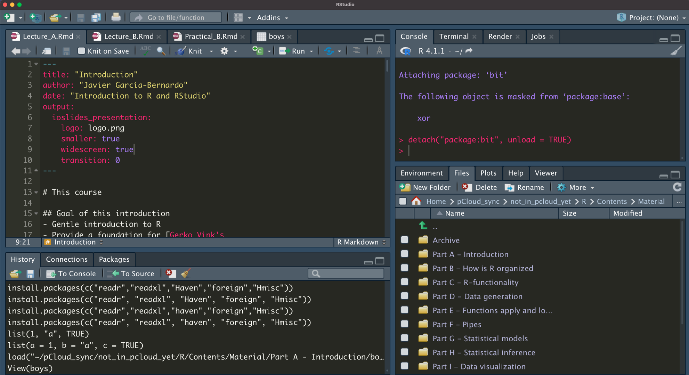
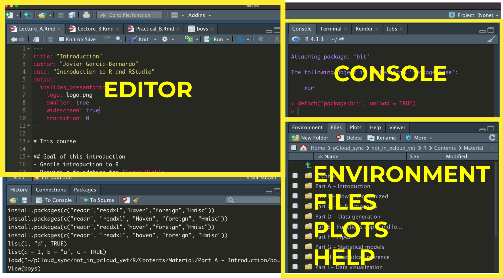
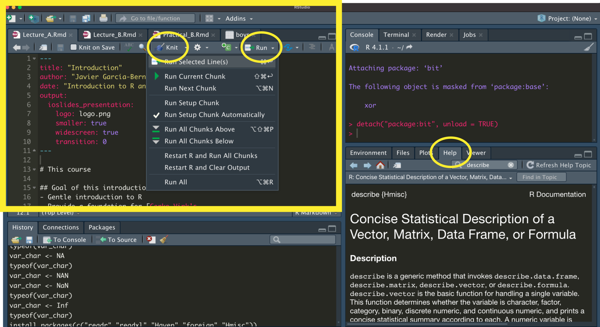
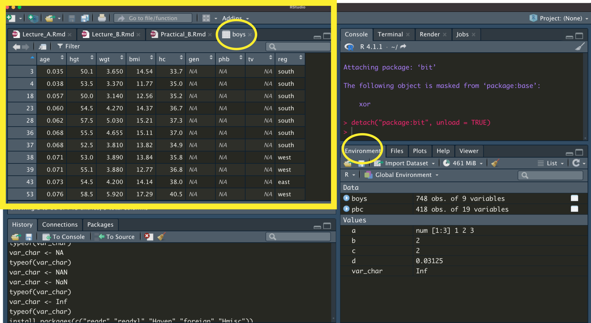
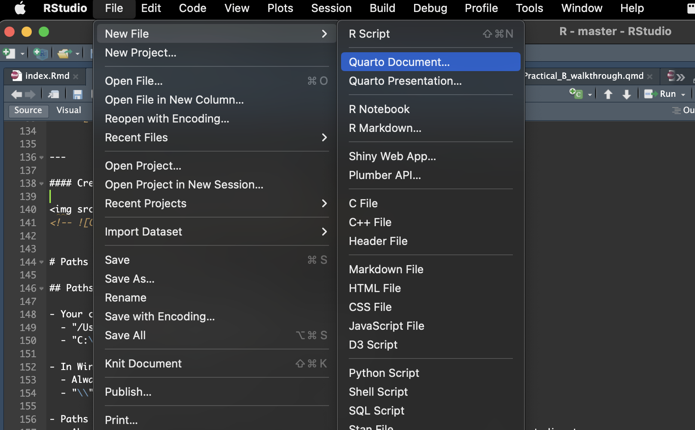

# This course

## Goal of this course
- Gentle introduction to:
  - Programming languages
  - R for data science
- Provide a foundation for [Gerko Vink's course](https://www.gerkovink.com/rijkR/)


## Why do we care about R?
- Why programming languages?
  - Faster
  - Easier
  - Beautiful
  - Flexibly (new methods)
  - Reproducibility! (open an old Excel file and try to understand what you did) 
  
- Why R:
  - Designed for statistics/data science
  - Huge community of users
  
- From a personal perspective: You know R = you are employed


## R for data science 
<figure>

<figcaption>Source: [R for Data Science](https://r4ds.had.co.nz/explore-intro.html)</figcaption>
</figure>


# What is R / RStudio?

## Communicating with the comptuer

### R ~ English
- Programming <b>language</b>, allows you to communicate with the computer

### RStudio: Integrated Development Environment ~ Word
- Using R as effective and efficient as possible:
  - Code editor
  - Nice extras: Syntax highlighting; Code completion; File explorer; Help

### R packages ~ Tabs in Word
- Extend the functionalities of base R
- You can install and use new packages:
```{r, eval = FALSE}
install.packages("ggplot2") #Install new package (you only need to do it once)
library(ggplot2) #Load the package
```


## RStudio

#### Source editor
Write your R code (load data, clean it, model it, etc)

#### Environment/Workplace
All the variables that you have defined

#### Files
File explorer, find your files. 

#### Help
Get information about code (super useful!)

#### Console 
Write R code (not recommended at this point) and see the output of your R scripts

#### Plots
See the plots, and export it

---

#### History 
History of all the code you have run. 

#### Packages
All packages that you have loaded (I don't recommend loading/unloading packages this way)

#### Terminal
Run commands on your terminal (this is not R, you won't need to use this)


---

<center>

</center>

---

#### Basic units of RStudio
<center>

</center>

---

#### Run pieces of code
<center>

</center>

---

#### View your data/objects
<center>

</center>

---

#### Create a new file: RScript and RNotebook
<center>

</center>

```{r}
getwd()
```


---

# Paths and working directory (folder)

## Paths and working directory (folder) I

- Your computer finds files by their path:
  - "/Users/javiergb/Desktop/somefile.csv" (Mac/Linux)
  - "C:\\Users\\javiergb\\Desktop\\somefile.csv" (Windows)

- In Windows:
  - Always use "/" (R will convert it)
  - "\\" is a "escape character", with a special meaning
  
- Paths can be:
  - Absolute (as the ones above). They are defined from the root directory, the top-most directory.
  - Relative. They are defined from the working directory
    - e.g. "data/somefile.csv" --> in our working directory, find the folder "data", and inside, the file "somefile.csv"

## Paths and working directory (folder) II

- Important shortcuts for relative paths:
  - "`../`somefile.csv": find "somefile.csv" one level down
  - "`../../`somefile.csv": find "somefile.csv" two levels down
  - "`./`somefile.csv": find "somefile.csv" in the current level (not so useful, it is identical to "somefile.csv")
  - "`~/`somefile.csv": find "somefile.csv" in your home directory

- Changing the working directory with RStudio:
  - "Session (top menu) -> Set Working directories"
  - "Files (RStudio unit) -> More --> Set as working directory"


# Type of R documents

---

### R-scripts (.R)
- Text file with R code (you can open it in any text editor)
- Working directory:
  - If associated to a project: your home directory (e.g. "/Users/javiergb") 
  - If not associated to a project: the project directory 
- Output in the console and the plots

### Rstudio-projects (.Rproj)
- Contains a .Rproj file within the directory, with project options
- Working directory of scripts within the project: the project directory where the .Rproj file resides.
- More info; https://bookdown.org/yih_huynh/Guide-to-R-Book/rstudio-set-up.html

### R-notebooks (.Rmd)
- R-markdown files (like this one!)
- Working directory: the directory where the notebook is located
- Most useful for data science
- Chunks of code and chunks of text
- Outputs directly in the editor. Can be knitted to HTML/PDF/Word


# How does R (and Python) work

## Variables and code
### Variables:
- Tell the computer to save an `object` (a number, a string, a spreadsheet) with a name.

- Creating variables in R is very straightforward: 
    - you just use `<-`

- For example, if you assign the value `100` (an element) to object `a`, you would type

```{r}
a <- 100
print(a)
```


### Code:
- Instructions to modify variables
- Can be organized in functions: blocks of code that take some input and return some output


## Objects in R: 
- Everything is an object in R
- The objects can be assigned to a variable name

### Basic data types (elements)
- `character`: "some text"
- Number:
  - `numeric`: e.g., 2.1
  - `integer`: e.g., 2L
- `logical`: TRUE/FALSE
- `factor`: e.g., factor("amsterdam")

### Basic data structures (consist of data types and functions to transform them)
- `vector`: c(2, 4, 2) 
- `list`: list(first_col = 1, second = "a", third = TRUE)
- `matrix`: matrix(c(4, 4, 4, 4),nrow = 2,ncol = 2)
- `data.frame`: The most important


## The help
- Everything that is published on the Comprehensive `R` Archive Network (CRAN) and is aimed at `R` users, must be accompanied by a help file. 
- If you know the name of the function that performs an operation, e.g. `anova()`, then you just type `?anova` or `help(anova)` in the console, or use the "Help" menu. 
- If you do not know the name of the function: type `??` followed by your search criterion. For example `??anova` returns a list of all help pages that contain the word 'anova'

- Alternatively, the internet will tell you almost everything you'd like to know and sites such as http://www.stackoverflow.com and http://www.stackexchange.com, as well as `Google` can be of tremendous help. 
    - If you google `R` related issues; use 'R:' as a prefix in your search term
    


## Calling objects
- You just use type the name you have given to the object

- For example, we assigned the value `100` to object `a`. To call object `a`, we would type

```{r}
a
```

## Writing code
### Using functions
```{r}
# This is a comment, it won't be read by R
student_number <- 4
paste("The number of students is: ", student_number, sep = " ")

#sep can be any character, or "\n" (newline), "\t" (tab),
```

---

### Using packages
```{r, eval = TRUE, echo = FALSE}
# install.packages("tidyverse") #installing packages
library(readr) #loading the library to read csv, usually on top of the file

# Using the readr library (the readr:: is optional, but useful when the function)
data <- readr::read_csv("../common_datasets/dataset_boys.csv", col_select = c("age","hgt"))
# Summary statistics
summary(data)
```

---
### Some other important considerations
- The computer cannot read your mind
```{r, error= TRUE}
a <- 100
print()
```

- The computer reads from the top to the bottom
```{r, error= TRUE}
a <- 100
print(b)
b <- 10
```


## Practical A

Goal: Get used to RStudio using R as a calculator
1. Create an R script
2. Create an R project
3. Create an R notebook


