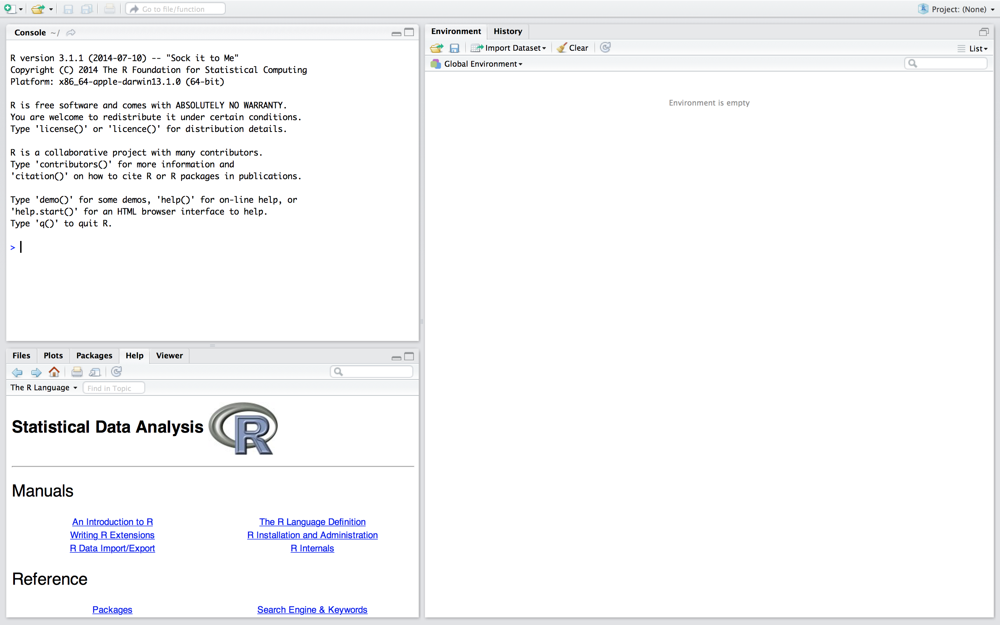
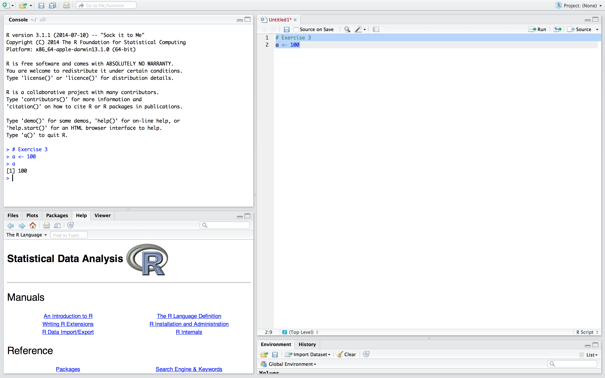
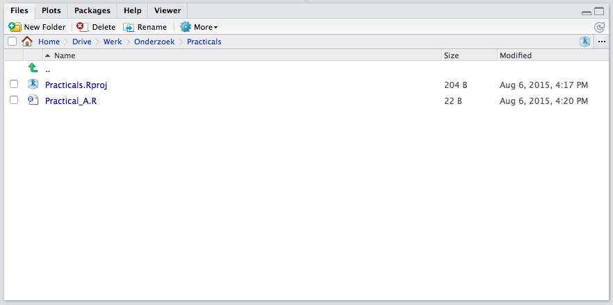

---

This morning we are going to get acquainted with `R`. A convenient way to work with `R` is with `RStudio`, as `RStudio` adds many features and convenient accessibility options to the plain `R` you have obtained from http://r-project.org. Most of these features go beyond the scope of this course, but as you will develop your `R` skillset, you might run into the need for `RStudio` at a later moment. Best to get to know `RStudio` now. 
 
If you have no experience with `R`, you will learn the most from following this document. If you have some experience with `R` already,  I suggest you try solving the questions without looking at the answers/walkthrough. You can then refer to the solutions at any time, if needed. 

If you have any questions or if you feel that some code should be elaborated, feel free to ask.


---

#### Exercises
We start with the very basics and will move towards more advanced operations in `R`. First we will get acquainted with the language (which is called `S` - to keep it simple) and the environment we work in. 

---

1. **Open `RStudio`**

The following window will appear. 


RStudio is divided in 3 panes, namely the console, the environment/history pane and the pane where we can access our files, plots, the help files, make packages and view our data objects. You can change the order of the panes to your liking through `RStudio`'s preferences. I did, that is why your pane layout might differ from the layout in the above screenshot.

If we open an `R`-script (i.e. a file that contains `R` code), a fourth pane opens. 

---

2. **Open a new `R`-script.**

In the top left you will find . Click it and select `R`-script. 

A new pane opens, and we can start typing our code. It is preferable to work from an `R`-script instead of directly working in the console for at least the following reasons (there are many more). 

a. You will not lose code, since `RStudio` caches files even if they are not saved. 
b. You log your own work. Code does not disappear over time, as you save the code in a separate file. 
c. With access to your `R`-script and data, others are able to exactly reproduce your work. Reproducibility is becoming increasingly more important, and this is where `RStudio` excells. 
d. You become more organized in coding, as you focus on creating readable code. In the long run, this will result in you becoming a more efficient programmer. Remember: efficient code runs faster. 

---

3. **Type the following in your new `R`-script**

```{r}
# Exercise 3
a <- 100
```

The `#` tells `R` that everything that follows in that specific line is not to be considered as code. In other words, you can use `#` to comment in your own `R`-scripts. I used `#` here to elaborate that the following line is the code from exercise 3. 

The line `a <- 100` assigns the value `100` to object `a`. When you run your code, it will be saved. The value 100 and the letter `a` are chosen to illustrate assigning in `R`. You might as well assign `123` to `banana` if you like. Really, anything goes. 

---

4. **Select both lines of code and run the code by pressing Ctrl-Enter or Ctrl-R (Windows/Linux) or Cmd-Enter (Mac)**

Your code is executed and now appears in the console. If you type `a` in the console, `R` will return the assigned value. Try it. 


The shortcut Ctrl-Enter or Cmd-Enter is your friend: it runs the current selection, or, if nothing is selected, the current line. if Ctrl-Enter or Cmd-Enter yields no result, you probably have selected the console pane. You can switch to the code pane by moving the mouse cursor and clicking on the desired line in the code pane, or through Ctrl-1 (Windows/Linux/Mac). Alternatively, you can move to the console through Ctrl-2 (Windows/Linux/Mac). 

This is how you enter and run code in `R` by using `RStudio`. 

---

5. **Save your code file as `Practical_A.R` in a folder named `Practicals`**

You can use the standard Ctrl-s (Windows/Linux) or Cmd-s (Mac) or click on the icon  in the code pane. 

Your document is now saved. We saved it in a separate folder so that we are able to create a project out of our practicals. 

---

6. **Create a project by clicking on  in the top-right corner of `RStudio`**

Select "New Project", click "Existing Directory" and navigate to the folder where you have just saved your code. When all is done, click on "Create Project"

You will notice in the files pane that a file `Practicals.RProj` has been created



The possibility to categorize your work in projects is one of the benefits of using `RStudio`. Within a project, everything is relative to the `.Rproj` file. This means that if you share the folder with someone else, this someone only has to open the `.Rproj` file to be able to access and run all code and documents involved with this project. Again, when considering reproducability of research, working in projects is a huge advantage. 

---

7. **Open the `R`-script `notebook.R`. **

---

8. **Have a look at the code in the script and make sure that you understand what is going on. If you do not understand what you are looking at, please ask me for help.** 

---
 
9. **Compile the script as a `html` file. Click on the  icon and select `html` as the notebook output format. **

The benefit of using html as an output format lies in the dimensional properties of a web-page. Especially when dealing with long code-files, large output from analyses or many graphs, exporting your file as html is much more convenient. You can simply scroll down or up to see the 'rest', instead of having to flip through pages back and forth to compare code, graphs or output. 

---

10. **Inspect the `html` file you have created. **

The notebook feature in `R-Studio` is very convenient; it runs and converts any `R`-code 
to a readable file where code and output are visible. There is, however, an even better format to integrate `R`-code with text into a single document: Markdown!

---

11. **Open the file `markdown.Rmd`. **

Have a look at the code in the script and make sure that you understand what is going on. If you do not understand what you are looking at, please ask someone for help. 

---

12. **Click `Knit HTML` to compile the file into a html-document. If necessary, install the required packages. Inspect the html file and compare it to the one you have created from the `notebook.R` file. **

In the rest of this course we will teach one another about `R` by showing our code and the resulting output in the plenary sessions. The notebook and markdown functionality in `R-Studio` are very convenient ways to do this. One of the reasons for using either format is that we can assess code on every machine, without the need for the packages / functionality that you used but someone else might not have. Please use one of these formats for the other practicals. 

---

13. **If not open anymore, open your script by clicking on `Practical_A.R` in the files pane. Run both lines of code again and inspect the contents of the global environment by typing and running `ls()`**

The following is returned by `R`
```{r}
ls()
```

There is one object in the environment, and it is called `a`. If you look at the environment pane, you can quickly see the corresponding information (i.e. there is no need to type `ls()`) and you can see that object `a` contains a value. You can even see which value. 

A value is the most basic object in `R`. The next step up in objects is a vector, followed by a matrix, followed by an array. Eventually, each of these objects can be stored in a list. We will learn about vectors, matrices and arrays later today. 

---

End of `Practical A`. Play around with `R` and `R-studio` if you like. Maybe create a notebook or markdown template file for the rest of the course? Add your name to it.
