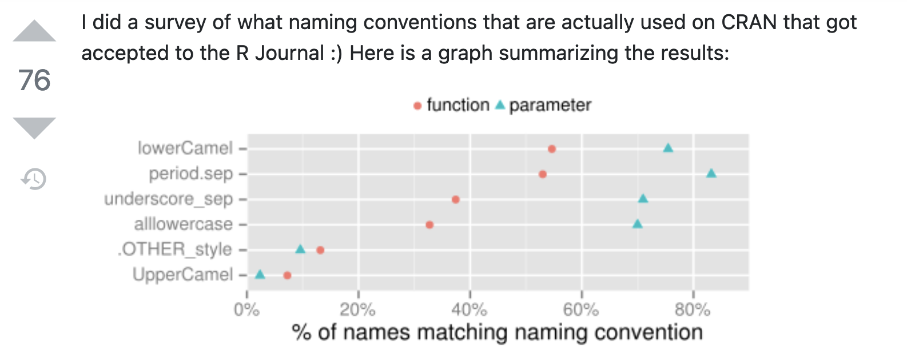

# Recap

## So far

This morning we have learned the basics of programming in `R`:
- Data
- How to assign elements to objects (`<-`)
- How to run code
- How to save `R`-scripts
- How to manage projects in `RStudio`
- How to create notebooks or markdown HTML files

```{r echo=FALSE}
set.seed(123)
```

# Quick detour

## Naming conventions
- Some programming languages tell you how to name your variables with spaces, but not R.
- I use `students_cleaned`. This is the standard of Python.


<figure>

<figcaption>Source: [stackoverflow](https://https://stackoverflow.com/questions/1944910/what-is-your-preferred-style-for-naming-variables-in-r)</figcaption>
</figure>


# Data Types (Elements)

## Data Types
- They are the basis of everything

### 1: Character
```{r}
var_char <- "ab"
typeof(var_char)
```

---

### 2: Numeric
```{r}
var_char <- 3.2
typeof(var_char)
```

```{r}
var_char <- "3"
typeof(var_char)

converted_var_char <- as.numeric(var_char)
typeof(converted_var_char)
```

---

```{r}
var_inf <- Inf
typeof(var_inf)

var_nan <- NaN
typeof(var_nan)
```


---

### 3: Logical
```{r}
var_true <- TRUE
typeof(var_true)
```
```{r}
as.numeric(var_true)
sum(var_true)
```


## Comparing elements
```{r}
a <- 3
b <- 5
a == b

a == "3"

a == 3
```

# Data Structures: Objects that contain more than one element

---

### Basic data types (elements)
- `character`: "some text"
- Number:
  - `numeric`: e.g., 2.1
  - `integer`: e.g., 2L
- `logical`: TRUE/FALSE
- `factor`: e.g., factor("amsterdam") --> Later

### Basic data structures (consist of data types and functions to transform them)
- `vector`: c(2, 4, 2) 
- `list`: list(first_col = 1, second = "a", third = TRUE)
- `matrix`: matrix(c(4, 4, 4, 4),nrow = 2,ncol = 2)
- `data.frame`: The most important


## 1: Vector
- We can assign more than one element to a vector (in this case containing numbers 1 through 5)
```{r}
#To create a vector we used `c()`, which stands for 'concatenation'. It is just a series of numbers or letters. 
a <- c(1, 2, 3, 4, 5)
a
b <- 1:5
b
```

## More than one element, with characters
Characters (or character strings) in `R` are indicated by the double quote identifier. 
```{r}
a_new <- c(a, "A")
a_new
```

## Quickly identifying elements in vectors

```{r}
rep(a, 15)
```

## Calling elements in vectors
If we would want just the third element, we would type
```{r}
#The first element in R is 1 (in other languages (e.g. Python) it is 0)
a[3]
```

## Calling elements in vectors by range
If we would want the first to the third (both included)
```{r}
#The first element in R is 1 (in other languages (e.g. Python) it is 0)
a[1:3]
```

Empty means all elements
```{r}
#The first element in R is 1 (in other languages (e.g. Python) it is 0)
a[]
```

## 2. Matrix: Multiple vectors in one object
This we would refer to as a matrix
```{r}
c <- matrix(3, nrow = 5, ncol = 2)
c
```

```{r}
#We can also create them with vectors, it fills the matrix by column. But be careful!
c <- matrix(c(1,2,3), nrow = 5, ncol = 2)
c
```

## Calling elements in matrices #1
- The first row is called by
```{r}
c[1, ]
```

- The second column is called by
```{r}
c[, 2]
```


## Calling elements in matrices #2
- The intersection of the first row and second column is called by
```{r}
c[1, 2]
```
- You can also use ranges
```{r}
c[1:3, 2]
```

In short; square brackets [] are used to call elements, rows, columns (and much more beyond the scope of this course)

## Matrices with mixed numeric / character data
If we add a character column to matrix `c`; everything becomes a character:
```{r}
cbind(c, c("a", "b", "c", "d", "e"))
```

Remember, matrices and vectors are numerical OR character objects. They can never contain both and still be used for numerical calculations. 

## 3. Data frames
```{r}
d <- data.frame("V1" = rnorm(5),
                "V2" = rnorm(5, mean = 5, sd = 2), 
                "V3" = c("a","a","b","b","b"))
d
```

We 'filled' a dataframe with two randomly generated sets from the normal distribution - where $V1$ is standard normal and $V2 \sim N(5,2)$ - and a character set. 

## Data frames (continued)
Data frames can contain both numerical and character elements at the same time, although never in the same column. 

You can name the columns and rows in data frames (just like in matrices)
```{r}
row.names(d) <- c("row 1", "row 2", "row 3", "row 4", "row 5")
d
```

## Calling row elements in data frames
There are two ways to obtain row `3` from data frame `d`:
```{r}
d["row 3", ]
```

and
```{r}
d[3, ]
```

---

and
```{r}
d[3:4, ]
```

The intersection between row 2 and column 3 can be obtained by
```{r}
d[2, 3]
```

## Calling columns elements in data frames
Both
```{r}
d[, "V2"] # and
d[, 2]
d$V2

```


## 4. Factor
- A datatype used to encode categorical variables
- It'll be useful during visualization
```{r}
d[, "V3_factor"] = as.factor(d[, "V3"])
d
str(d[, "V3_factor"])
```

## Use of as.xxx functions
You can convert between data types (as long as the conversion is valid)
```{r}
d[, "V2_int"] = as.integer(d[, "V2"])
d
```


## 5. List: Mixed type
You can have a list of everything mixed with everything. 
For example, an simple list can be created by
```{r}
a <- 1:5 #a vector
f <- list(a) #convert to a list
f
```

Elements or objects within lists can be called by using double square brackets [[]]. For example, the first (and only) element in list `f` is object `a`
```{r}
f[[1]]
```

## Lists (continued)
We can simply add an object or element to an existing list
```{r}
f[[2]] <- d
f
```
to obtain a list with a vector and a data frame. 

## Lists (continued)
We can add names to the list as follows
```{r}
names(f) <- c("vector", "data frame")
f
```

## Lists (continued)
We can also create it as 
```{r}
f <- list("vector" = 1:5, 
          "data frame" = f)
f
```

## Calling elements in lists
Calling the vector (a) from the list can be done as follows
```{r}
f[[1]]
f[["vector"]]
f$vector
```

## Lists in lists
```{r}
g <- list(1:4, list("vector" = 5:1,
                    "matrix_ex" = matrix(0, nrow = 2, ncol = 2)))
g
```


To call the vector from the second list within the list g, use the following code
```{r}
g[[2]][[1]] #Also g[[2]]$vector

```

# Filtering by condition

## Logical operators
- Logical operators are signs that evaluate a statement, such as `==`, `<`, `>`, `<=`, `>=`, and `|` (OR) as well as `&` (AND). Typing `!` before a logical operator takes the complement of that action. There are more operations, but these are the most useful. 

- For example, if we would like elements out of example vector below that are larger than 3, we would type:
```{r}
example_vector = c(1,2,3,4,5,6,7,8,9)
example_vector[example_vector>3]

```

## Why does this work?
```{r}
example_vector > 3
```


## Logical operators (cont'd)
- If we would like the elements that are smaller than 3 OR larger than 3, we could type
```{r}
example_vector[(example_vector < 3) | (example_vector > 3)] #c smaller than 3 or larger than 3
```
or
```{r}
example_vector[example_vector != 3] #c not equal to 3
```


# Functions

## Basic idea
- Take some standard input (e.g. a vector of numbers)
- Return some standard output (e.g. the mean)
- You call them with parenthesis
```{r, eval = FALSE, echo = TRUE}
mean(c(1,2,3,4,5))
```

- You can save the output with a name
```{r, eval = FALSE, echo = TRUE}
mean_v <- mean(c(1,2,3,4,5))
mean_v
```


- When they come from a package, you can call them in two ways
```{r, eval = FALSE, echo = TRUE}
#install.packages("dplyr")
library(dplyr)
#R will add the new variables to the global environment, replacing if already exists
n_distinct(c(1,2,2,3,3))
#You can specify the package where the library comes from
dplyr::n_distinct(c(1,2,2,3,3))
```

---

- They have arguments (i.e., things that the function need to work). 
- Usually at least one is required. e.g., in the mean example you need to pass a vector of numbers.
- Other arguments tell the function how it should handle the input. In the example below it tells the mean function to remove missing values.
```{r}
mean(c(1,2,3,4,5,NA))
mean(c(1,2,3,4,5,NA),na.rm = TRUE)
```


- You can create your own (more on this next day)
```{r}
my_mean <- function(vector_num){
  return(sum(vector_num)/length(vector_num))
}

my_mean(c(1,2,3,4,5))
```


# Math errors

## Things that cannot be done
- Things that have no representation in real number space (at least not without tremendous effort)
    - For example, the following code returns "Not a Number"
```{r}
0 / 0
```

- Also impossible are calculations based on missing values (NA's)
```{r}
mean(c(1, 2, NA, 4, 5))
```

## Ignoring missing values (often not recommended)
There are two easy ways to perform "listwise deletion":
```{r}
mean(c(1, 2, NA, 4, 5), na.rm = TRUE)
mean(na.omit(c(1, 2, NA, 4, 5)))
```

## Floating point example
```{r}
(3 - 2.9)
(3 - 2.9) == 0.1
(3 - 2.9) - .1

```
## Floating point example
```{r}
#install.packages("dplyr")
#library(dplyr) #we already run this earlier, we don't need it again
dplyr::near((3 - 2.9), 0.1)
```

# Applications
## Reading a CSV file and calculating descriptive statistics
That was dry, but let's see some potential, reading a CSV file and calculating some descriptive statistics.

You can read many types (you'll need)
```{r, eval = FALSE, echo = TRUE}
#install.packages(c("readr","readxl","haven","foreign","Hmisc"),repos = "http://cran.us.r-project.org")

#Read CSV (the good way)
readr::read_delim("a,b\n1,2,3\n4,5,6", delim = ",")

#Read RDS (R format)
readr::read_rds("here_path.Rds")

#Read Excel
readxl::read_excel("here_path.xlsx")

#Read Stata
haven::read_dta("here_path.dta")

#Read SPSS
haven::read_spss("here_path.sav")
```

## Calculate some descriptive statistics
```{r, eval = FALSE, echo = TRUE}
str(df)
```

```{r, eval = FALSE, echo = TRUE}
summary(df)
```

```{r, eval = FALSE, echo = TRUE}
Hmisc::describe(df)
```

## Some programming tips:
- Keep your code clean
  - Break the code in components, clean out old code that you commented out.
  - Use (at least) a folder for the data, and another for figures; don't save all code in one folder.
  - If you have several R files, use descriptive names (e.g. 1_data_collection.Rmd; 2_data_cleaning.Rmd; etc)
  - Write all code in the source editor, don't use the console until you know what you are doing. Otherwise you'll forget to copy a step to the code and you'll not be able to remember what you did.

- Use comments (text preceded by `#`) to clarify what you are doing
  - If you look at your code again, one year from now: you will not know what you did --> unless you use comments 


## Useful shortcuts
- `Tab` while typing in the console: list all objects with that name
- `Ctrl + Enter` (Windows) or `Cmd + Enter` (Mac): run line or selection
- `Ctrl+Alt+I` (Windows) or `Cmd+Option+I` (Mac): insert R chunk


# Practical

## How to approach the next practical
Aim to make the exercises without looking at the answers. 
- Use the answers to evaluate your work
- Use the help to identify the workings of functions

If this does not work out --> switch to the answer-based practical. 

In any case; ask for help when you feel help is needed. 
- Do not 'struggle' for too long: we only have limited time!


