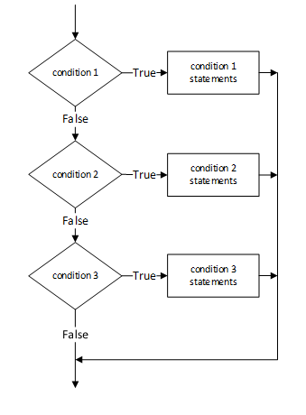

```{r, include=FALSE}
library(tidyverse)
```

# Recap

## Last week
- How to use `R`, `RStudio`, `R`-scripts and `R`-notebooks
- Data types (elements)
  - character, numeric, integer, logical, factor
- Data structures: composed of data types
  - vector, matrix, list, **data.frame**
- Subsetting data structures
- Reading files in different formats
- Data visualization: design and storytelling

## Today: How to organize and automate your code

#### First half
- Best practices in R
- Reproducible science and dependency management in R
- Control-flow: 
  - Choice: if-else statements
  - Loops: For loops
- Functions
- Environments

#### Second half: Tidyverse
- Inferential statistics: A 5-min primer of linear regression
- Reading and writing files in serveral formats
- Principles of tidy data and short comparison of base R and the tidyverse
- Data wrangling with the tidyverse


# Best practises in R


## Naming conventions: File names

File names should end in `.R` and be meaningful. 

GOOD:
```{r eval=FALSE}
predict_ad_revenue.R
```

BAD:
```{r eval=FALSE}
foo.R
```

## Naming conventions: Identifiers

Use underscores ( _ ) to separate words within a name (see more here: http://adv-r.had.co.nz/Style.html)

1. Variable names should be nouns and function names should be verbs. 
2. Strive for names that are concise and meaningful 
3. Avoid using names of existing functions and variables


## Syntax: Line Length

The maximum line length is 80 characters.

```{r, eval=FALSE}
# This is to demonstrate that at about eighty characters you would move off of the page

# Also, if you have a very wide function
fit <- lm(age ~ bmi + hgt + wgt + hc + gen + phb + tv + reg + bmi * hgt + wgt * hgt + wgt * hgt * bmi, data = boys)

# it would be nice to pose it as
fit <- lm(age ~ bmi + hgt + wgt + hc + gen + phb + tv + reg + bmi * hgt 
          + bmi * wgt + wgt * hgt + wgt * hgt * bmi, data = boys)
#or
fit <- lm(age ~ bmi + hgt + wgt + hc + gen + phb + tv + reg 
          + bmi * hgt 
          + bmi * wgt
          + wgt * hgt 
          + wgt * hgt * bmi, 
          data = boys)
```


## Syntax: Indentation

When indenting your code, use two spaces. `RStudio` does this for you!

Never use tabs or mix tabs and spaces. 

Exception: When a line break occurs inside parentheses, align the wrapped line with the first character inside the parenthesis.

```{r, eval=FALSE}
apply(boys,
      MARGIN = 2,
      FUN = length)
```

## Syntax: Spacing
Place spaces around all binary operators (=, +, -, <-, etc.). 

Exception: Spaces around ='s are optional when passing parameters in a function call.
```{r eval=FALSE}
lm(age ~ bmi, data=boys)
```
or
```{r eval=FALSE}
lm(age ~ bmi, data = boys)
```

## Syntax: Spacing (continued)
Do not place a space before a comma, but always place one after a comma. 

GOOD:
```{r eval=FALSE}
tab.prior <- as_tibble(d[d$x < 2, "x"])
total <- sum(d[, 1])
total <- sum(d[1, ])
```


## Syntax: Spacing (continued)
BAD:
```{r eval=FALSE}
# Needs spaces around '<'
tab.prior <- table(df[df$days.from.opt<0, "campaign.id"])  
# Needs a space after the comma
tab.prior <- table(df[df$days.from.opt < 0,"campaign.id"])  
# Needs a space before <-
tab.prior<- table(df[df$days.from.opt < 0, "campaign.id"]) 
# Needs spaces around <-
tab.prior<-table(df[df$days.from.opt < 0, "campaign.id"])  
# Needs a space after the comma
total <- sum(x[,1])  
# Needs a space after the comma, not before 
total <- sum(x[ ,1])  
```


## Syntax: Spacing (continued)
Place a space before left parenthesis, except in a function call.

GOOD: 
```{r eval=FALSE}
if (debug)
```

BAD:
```{r eval=FALSE}
if(debug)
```

## Syntax: Extra spacing
Extra spacing (i.e., more than one space in a row) is okay if it improves alignment of equals signs or arrows (<-).
```{r eval = FALSE}
plot(x    = x.coord,
     y    = data.mat[, MakeColName(metric, ptiles[1], "roiOpt")],
     ylim = ylim,
     xlab = "dates",
     ylab = metric,
     main = (paste(metric, " for 3 samples ", sep = "")))

```

Do not place spaces around code in parentheses or square brackets.

Exception: Always place a space after a comma.


## Syntax: In general...
- Use common sense and BE CONSISTENT.

- The point of having style guidelines is to have a common vocabulary of coding 
    - so people can concentrate on what you are saying, rather than on how you are saying it. 

- If the code that you add to a script looks drastically different from the existing code around it, the discontinuity will throw readers out of their rhythm when they go to read it. Try to avoid this.


## Working in projects in `RStudio`
- Every research project has its own project
- Every project can have its own folder, which also serves as a research archive
- Every project can have its own version control system (e.g. github)
- Every project can have its own dependency management (e.g. renv)

# Reproducibility

## __Keep your code clean__ {.build}

1. Break the code in components, keep it tidy
2. Use (at least) one folder for the data, and one for figures; don't save all code in one folder.
3. If you have several R files, use descriptive names (e.g. 1_data_collection.Rmd)
4. Write all code in the source editor, don't use the console until you know what you are doing.
5. You shouldn't need to write a command more than two times. 
   - If you are doing something similar several times --> Use __functions__ (e.g. you made an amazing plot and you want to use it for two subsets of the data)
      - Reusable in other projects
   - If you find yourself writing the same thing several times --> use __for loops__ (potentially with `purrr::map` for convenience)
   - Both functions and loops allow you:
      - Have a clear code
      - Easier to maintain / less errors
6. Use __comments__ (text preceded by `#`) to clarify what you are doing
  - If you look at your code again, one year from now: you will not know what you did --> unless you use comments 
  
## Dependency management {.build}

Each project uses specific versions of the packages.

What happens if the function that you are using is deprecated in a new version?

We should separate the packages we use in each project.

- Tools: 
   - conda / `mamba` / poetry (Python): Use virtual environments to compartmentalize projects 
   - `renv` (R): Load the right version of packages when you open the project

- Dependencies are specified in plain text files:
   - Python: requirements.txt, environment.yml (conda/mamba), pyproject.toml (poetry)
   - R: renv.lock

- Caveats:
   - Results may depend on the Operating System --> You could use Docker
   - Packages may be deleted


## Dependency management workflow {.build}
- Python
  - Create environment: `mamba env create -n my_cool_project python=3`
  - Activate environment: `mamba activate my_cool_project`
  - Install packages: `mamba install jupyter pandas scipy`
  - Export when ready: `mamba export -n my_cool_project > my_cool_project.yml`
  - Delete when you're done: `mamba env remove -n my_cool_project`
  - Restore if you need it: `mamba env create --file my_cool_project.yml`
  
- R
  - Create project (RStudio)
  - Create renv file: `renv::init()`
  - Install packages: `install.packages("tidyverse")`
  - Export when ready: `renv::snapshot()`
  - Restore if you need it: `renv::restore()`

## Version control {.build}
- I just messed up something and closed the file. How do I go back?

- Solutions:
  - Okay: Use a cloud system (most offer 30-days backups)
  - Better: Use `git` (e.g. provided by github)


- Workflow (for one person, not for teams):
  - Create repository, selecting README.md and .gitignore files
  - Add files that you want to upload: git add file 1_data_cleaning.R
  - Commit files: git commit -m "add data cleaning pipeline"
  - Push changes online: git push origin main
  - If things change online: git pull origin main


  
# Control-flow


## New controls and functions 


- Choice: 
  - We often want to run some code ***only if*** some ***condition*** is true.
  - `if(cond)` `{cons.expr}`  `else`  `{alt.expr}`
- Loops: 
  - We often want to repeat the execution of a piece of code many times.
  - `for(var in seq)` `{expr}`

Loops in R often happen under the hood, using apply functions:

- `apply()`: apply a function to margins of a matrix
- `sapply()`: apply a function to elements of a list, returns `vector` or `matrix`
- `lapply()`: apply a function to elements of a list, returns `list`


# Control-flow (I): Choice

## If statement

:::: {style="display: flex;"}

::: {.column width="50%"}


Operation of an __if__ statement:

{width=50%}

:::

::: {.column width="45%"}
Code of an if statement:
```{r}
value <- 3
if (value > 3) { #text expression
  print("Value greater than 3") #body of if
}  

```

:::

::::


## If-else statements

:::: {style="display: flex;"}

::: {.column width="50%"}


Operation of an if-else statement:
{width=60%}
:::

::: {.column width="45%"}
Code of an if-else statment:
```{r}
value <- 3
if (value > 3) { #test expression
  print("Value greater than three") #body of if
} else {
    print("Value <= 3") #body of else
}
```

:::

::::


## If-else statements

:::: {style="display: flex;"}

::: {.column width="50%"}


Operation of an if-else if statement:
{width=70%}

:::

::: {.column width="45%"}
Code of an if-else if statment:
```{r}
value <- 3
if (value > 3) { #condition 1
  print("Value greater than 3") #condition 1 statements
} else if (value > 1) { #condition 2
 print("Value greater than 1")  #condition 2 statements
} else if (value > 0) { #condition 3
 print("Value greater than 0")  #condition 3 statements
}
```

You can also add an else at the end.

:::

::::

## Subsetting consists of if-else statements

Remember our example from last time


```{r}
example_vector = c(1,2,3,4,5,6,7,8,9)
example_vector>3
example_vector[example_vector>3]
```

The computer keeps the value of the elements of example_vector **if** the corresponding elements in the condition (`example_vector>3`) are TRUE.


## Vectorized version of if-else statements

Operations in R are much faster when applied at once to a vector


```{r}
example_vector = c(1,2,3,4,5,6,7,8,9)
ifelse(example_vector > 5.5, "Pass","Fail")
```


# Control-flow (II): Loops

## For loops
For loops are used when we want to perform some repetitive calculations. 

```{r, collapse=TRUE}
# Let's print the numbers 1 to 6 one by one. 
print(1)
print(2)
print(3)
print(4)
print(5)
print(6)
```


## For-loops

For-loops allow us to automate this!

For each element of `1:6`, print the element:
```{r}
for (i in 1:6){
  print(i)
}
```

## For-loops 
You can use any variable name, `i` is a convention for counting/index.
```{r}
for (some_var_name in 1:6){
  print(some_var_name)
}
```


## For-loops (visually)


## Subsetting consists of for-loops and if-else statements

```{r}
example_vector = c(1,2,3,4,5,6,7,8,9)
example_vector>3
example_vector[example_vector>3]
```

***For*** each element in example_vector, keep the value ***if*** the corresponding element of the condition (`example_vector>3`) is TRUE


## For-loops
Often you don't want to iterate over a range, but over an object

```{r}
for (element in c("Amsterdam","Rotterdam","Eindhoven")){
  print(element)
}
```

```{r}
for (element in c("Amsterdam","Rotterdam","Eindhoven")){
  print(element)
  if (element == "Amsterdam"){
    print("Terrible football team.")
  } else {
    print("Not the prettiest city, but at least their football team is okay.")
  }
}
```


## For-loops 

Something a bit more useful

```{r}
df <- data.frame("V1" = rnorm(5),
                "V2" = rnorm(5, mean = 5, sd = 2), 
                "V3" = rnorm(5, mean = 6, sd = 1))

head(df)


```

## For-loops 

Doing an operation on each column
```{r}
for (col in names(df)) {
  print(col)
}

for (col in names(df)) {
  print(col)
  print(mean(df[, col]))
}

```

## For-loops 

Doing an operation on each row

```{r}
for (row in 1:nrow(df)) {
  row_values = df[row, ]
  print(row_values)
  print(sum(row_values>5))
}

```

## While loops 
Do something forever until a condition is (not) met 
```{r}
i  = 0
while (i < 10) {
  i =  i + 1
  print(i)
}
```


More info on loops: https://www.datamentor.io/r-programming/break-next/


# The `apply()` family
## `apply()`

The `apply` family is a group of very useful functions that allow you to easily execute a function of your choice over a list of objects, such as a `list`, a `data.frame`, or `matrix`.

We will look at three examples:

- `apply`
- `sapply`
- `lapply`

There are more:
- `vapply`
- `mapply`

## `apply()` {.build}
`apply` is used for matrices/dataframes. It applies a function to each *row* or *column*. It returns a vector or a matrix.

```{r, collapse=TRUE}
head(df, 1)
```

Apply it by row (MARGIN = 1):
```{r, collapse=TRUE}
apply(df, MARGIN = 1, mean)
```


Apply it by column (MARGIN = 2):
```{r, collapse=TRUE}
apply(df, MARGIN = 2, mean) #Identical to colMeans(df), which is much faster
```

## `apply()`

It doesn't need to aggregate:
```{r, collapse=TRUE}
apply(df, MARGIN = 2, sqrt)
```

## `sapply()` {.build}
`sapply()` is used on `list`-objects. It returns a vector or a matrix.

```{r}
my.list <- list(A = c(4, 2, 1), B = "Hello.", C = TRUE)
sapply(my.list, class)
```


```{r}
my.list <- list(A = c(4, 2, 1), B = c("hello","Hello","Aa","aa"), C = c(FALSE,TRUE))
sapply(my.list, range)
```


Why is each element a character string?

## `sapply()`

Any `data.frame` is also a `list`, where each column is one `list`-element.

This means we can use `sapply` on data frames as well, which is often useful.


```{r}
sapply(df, mean)
```

## `lapply()`

`lapply()` is *exactly* the same as `sapply()`, but it returns a list instead of a vector.
```{r}
lapply(df, class)
```


# Writing your own functions

## What are functions?

Functions are reusable pieces of code that 

1. take some standard input (e.g. a vector of numbers)
2. do some computation  (e.g. calculate the mean)
3. return some standard output (e.g. one number with the mean)

We have been using a lot of functions: code of the form `something()` is usually a function. 

```{r}
mean(1:6)
```

## Our own function

We can make our own functions as follows:

```{r}
squared <- function (x){
  x.square <- x * x
  return(x.square) 
}

squared(4)
```

`x`, the input, is called the (formal) *argument* of the function. `x.square` is called the *return value*.

## Our own function

If there is no `return()`, the last line is automatically returned, so we can also just write:


```{r}
square <- function(x){
  x * x
}

square(-2)
```

I do not recommend this, please always specify what you return unless you have a one-line function.


## Anonymous/Lambda expressions

```{python, eval=FALSE, python.reticulate=FALSE}
df["number_children"].apply(lambda x: "low" if x in {1,2} else "high")
```


```{r}
sapply(df, {function(x) quantile(x, .42)})
```


## Default options in functions {.build}
* Default options for some arguments are provided in many functions. 
* They allow us to provide an additional option, but if no choice is provided, we can choose for the user of the function. 

```{r}
is_contained <- function(str_1, str_2, print_input = TRUE){
  if (print_input){
    cat("Testing if", str_1, "contained in", str_2, "\n")
  }
  return(str_1 %in% str_2)
}
```


```{r, collapse=TRUE,eval=FALSE}
is_contained("R", "rstudio")
```
```{r, collapse=TRUE}
is_contained("R", "rstudio")
is_contained("R", "rstudio", print_input = TRUE)
is_contained("R", "rstudio", print_input = FALSE)
```

## Create documentation of functions

```{python, eval=FALSE, python.reticulate=FALSE, collapse=TRUE}
##Python
def square(x):
  """
  Squares a number

  Parameters:
  x (float): Number (or vector)

  Returns:
  float: Squared numbers
  """
  return(x**2)
```


```{r, collapse=TRUE}
##R more info at https://r-pkgs.org/man.html

#' Squares a number
#' 
#' @param x A number.
#' @returns A numeric vector.
#' @examples
#' square(3)
square <- function(x){
  x * x
}
```


## Troubleshooting
* Your first self-written for-loop, or function, will probably not work.

* Don't panic! Just go line-by-line, keeping track of what is currently inside each variable. 
* Stackoverflow is your friend.


# Scoping rules in `R` 

## Global environemnt (workspace)

When you write the name of a variable, R needs to find the value.

In the interactive computation (outside of functions, e.g., your console), this happens in the following order:

- First, search the global environment (i.e., your workspace) 
- If it cannot be found, search each of the loaded packages


```{r}
search()
```
The order of packages is important.


## Scoping rules in `R`: Functions

Inside a function, this happens in the following order:

- First, search within the function.
- If it cannot be found, search in the global environment (i.e., your workspace) 
- If it cannot be found, search each of the loaded packages


```{r, collapse=TRUE}
y <- 3
test_t <- function() {
  print(y)
}
test_t()
```
```{r, collapse=TRUE}
y <- 3
test_t <- function() {
  y <- 2
  print(y)
}
test_t()
```

## Scoping rules in `R`: Functions

What happens inside a function, stays within a function (unless you specify it differently)


```{r}
y <- 3
test_t <- function() {
  y <- 2
  print(y)
}
test_t()
y
```

## Scoping rules in `R`: Packages

Packages are neatly contained/isolated, so they are not affected by your code.They do so through namespaces: 

- Namespaces allow the package developer to hide functions and data.
- Objects in the global environment that match objects in the function's namespace are ignored when running functions from packages (prevent clashes)
- Functions are executed within the namespace of the package and have access to the global environment
- They provide a way to refer to an object, with the double colon `::`

```{r}
dplyr::n_distinct(c(1,2,3,4,2))
```

## Scoping rules in `R`: Packages (good practices)
- Pass to the function (using arguments) ***everything*** that the function needs to use (i.e. don't define something outside the function that is being used for the function)

BAD
```{r, eval=FALSE}

shifted_mean <- function(numbers) {
   return(mean(numbers) + shift_by)
}

shift_by <- 3
shifted_mean(c(1,2,3))
```

GOOD
```{r, eval=FALSE}
shifted_mean <- function(numbers, shift_by) {
   return(mean(numbers) + shift_by)
}

shift_by <- 3
shifted_mean(c(1,2,3), shift_by)
```

# Practical


