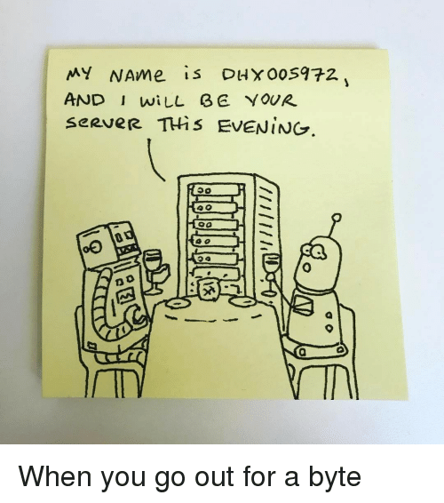

```{r setup, include=FALSE}
knitr::opts_chunk$set(dev.args=list(bg="transparent"))
```


## Packages and functions that we use
```{r message=FALSE, warning=FALSE}
library(mvtnorm)  # Multivariate Normal tools
```
- `table()`: Build a contingency table out of counts
- `hist()`: Draw a histogram
- `mvtnorm::rmvnorm()`: Drawing values from a multivariate normal distribution
- `sample()`: Probabilistic sampling with or without replacement
- `rchisq()`: Probabilistic sampling from a $X2$ distribution
- `rpois()`: Probabilistic sampling from a poisson distribution
- `set.seed(123)`: Fixing the Random Number Generator seed


## Creating our own data
We saw that we could create vectors
```{r}
c(1, 2, 3, 4, 3, 2, 1)
c(1:4, 3:1)
```

We could create matrices 
```{r}
matrix(1:15, nrow = 3, ncol = 5, byrow = TRUE)
```

## Creating our own data

Vectors from matrices
```{r}
mat <- matrix(1:18, 3, 6)
mat
c(mat)
```

## But we can also draw a sample
Of the same size,
```{r}
sample(mat)
```
smaller size,
```{r}
sample(mat, size = 5)
```
or larger size
```{r}
sample(mat, size = 50, replace = TRUE)
```

## We can do random sampling
```{r}
hist(sample(mat, size = 50000, replace=TRUE), breaks = 0:18)
```

## Or nonrandom sampling
```{r fig.height=3}
probs <- c(rep(.01, 15), .1, .25, .50)
probs
hist(sample(mat, size = 50000, prob = probs, replace=TRUE), breaks = 0:18)

```

## We can replicate individual samples
```{r}
set.seed(123)
sample(mat, size = 50, replace = TRUE)
set.seed(123)
sample(mat, size = 50, replace = TRUE)
```

## We can replicate a chain of samples
```{r}
set.seed(123)
sample(mat, size = 5, replace = TRUE)
sample(mat, size = 7, replace = TRUE)
set.seed(123)
sample(mat, size = 5, replace = TRUE)
sample(mat, size = 7, replace = TRUE)
```

## The random seed
The random seed is a number used to initialize the pseudo-random number generator

If replication is needed, pseudorandom number generators must be used

- Pseudorandom number generators generate a sequence of numbers
- The properties of generated number sequences approximates the properties of random number sequences
- Pseudorandom number generators are not truly random, because the process is determined by an initial value. 

The initial value (the seed) itself does not need to be random.

  - The resulting process is random because the seed value is not used to generate randomness
  - It merely forms the starting point of the algorithm for which the results are random. 

## Why fix the random seed
When an `R` instance is started, there is initially no seed. In that case, `R` will create one from the current time and process ID. 

- Hence, different sessions will give different results when random numbers are involved. 
- When you store a workspace and reopen it, you will continue from the seed specified within the workspace. 

***If we fix the random seed we can exactly replicate the random process***

`If the method has not changed:` the results of the process will be identical when using the same seed. 

  - Replications allows for verification
  - But beware: the process depends on the seed
    - The results obtained could theoretically be extremely rare and would not have occured with every other potential seed
    - Run another seed before publishing your results


## Random seeds
<center>

</center>

## Random processes
<center>

</center>

## Drawing data

We can draw data from a standard normal distribution
```{r}
hist(rnorm(1000, mean = 5, sd = 1))
```

## Drawing data

We can draw data from a specific normal distribution
```{r}
hist(rnorm(1000, mean = 50, sd = 15))
```

## Drawing data: many values
```{r}
hist(rnorm(100000, mean = 50, sd = 15))
```

## Drawing data: other distribution
$X^2$-distribution with $df = 1$ degrees of freedom
```{r}
hist(rchisq(500, df = 1))
```

## Drawing data: other distribution
$X^2$-distribution with $df = 100$ degrees of freedom
```{r}
hist(rchisq(500, df = 100))
```

## Drawing data: other distribution
Poisson distribution with mean $\lambda = 1$ 
```{r}
hist(rpois(5000, lambda = 1))
```

## Drawing data: other distribution
Poisson distribution with mean $\lambda = 10$ 
```{r}
hist(rpois(5000, lambda = 100))
```

## Drawing data: other distribution
Binomial distribution: 1000 draws of 1 trial with $P(\text{success}=.75)$
```{r fig.height=2}
run <- rbinom(1000, size = 1, prob = .75) 
table(run)
```
```{r fig.height=3, echo=FALSE}
hist(run)
```

## Drawing data: other distribution
Binomial distribution: 10.000 draws of 60 trials with $P(\text{success}=.75)$
```{r fig.height=2}
run <- rbinom(10000, size = 60, prob = .75)
table(run)
```
```{r fig.height=3, echo=FALSE}
hist(run)
```

## Drawing multivariate distributions
```{r}
sigma <- matrix(c(30, 15, 15, 30), 2, 2)
sigma
means <- c(97, 63)
data <- rmvnorm(n = 1000, mean = means, sigma = sigma)
colMeans(data)
var(data)
```

## Bivariate normal
```{r}
plot(data)
```

## Drawing multivariate distributions
```{r}
sigma <- matrix(c(1, 0, 0, 1), 2, 2)
sigma
means <- c(0, 0)
data <- rmvnorm(n = 1000, mean = means, sigma = sigma)
colMeans(data)
var(data)
```

## Bivariate normal
```{r fig.height=5, fig.width=5}
plot(data)
```

## Histograms
```{r}
par(mfrow = c(1, 2))
hist(data[, 1])
hist(data[, 2])
```

## To conclude
<center> 

</center>
[source](https://www.reddit.com/r/ProgrammerHumor/comments/8za9b6/hello_i_am_your_server_for_today/)

# Practical

- 

