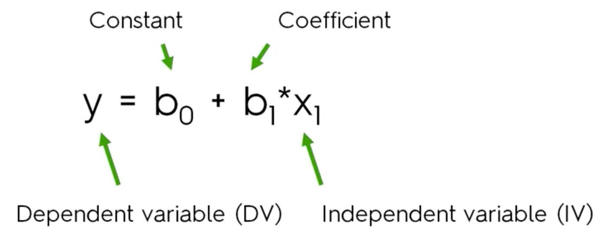
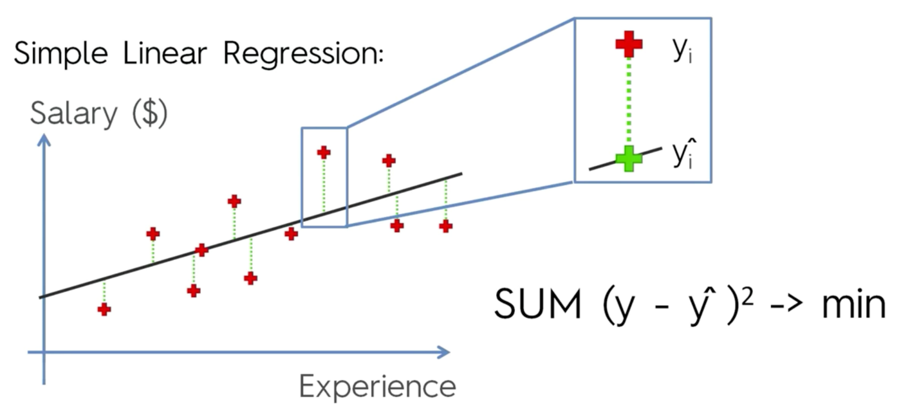
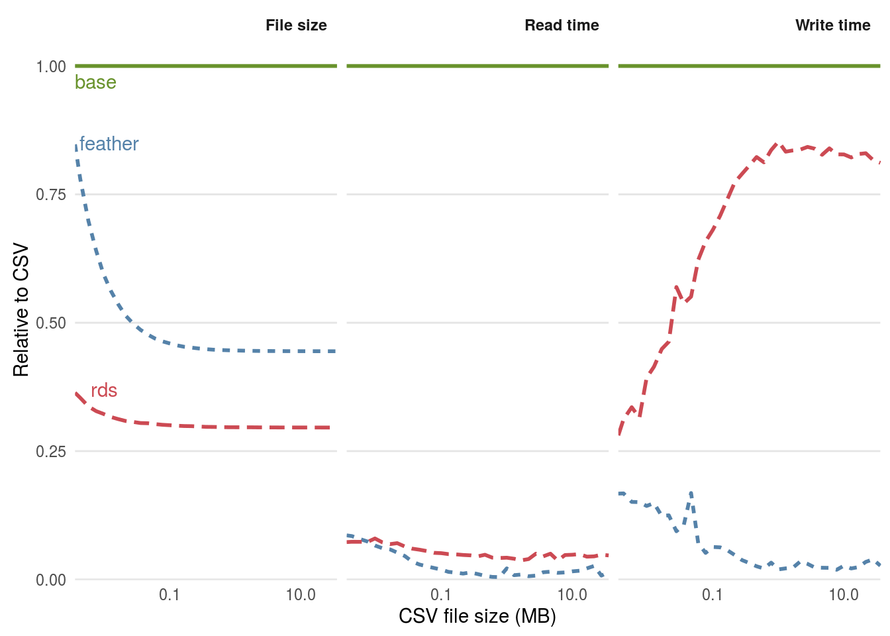
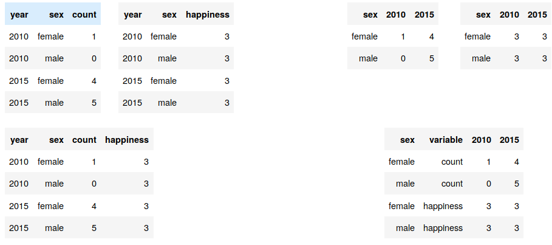

## Today: How to organize and automate your code

#### First half
- Best practices in R
- Control-flow: 
  - Choice: if-else statements
  - Loops: For loops
- Functions
- Environments

#### Second half
- Inferential statistics: A 5-min primer of linear regression
- Reading and writing files in serveral formats
- Principles of tidy data and short comparison of base R and the tidyverse
- Data wrangling with the tidyverse


# Modeling

## Linear regression (model)

{width=70%}

## Linear regression (visual interpretation)

{width=100%}

## Linear regression (fitting)
{width=100%}


## Modeling in `R`
To model objects based on other objects, we use `~` (tilde)

For example, to model the relationship between body mass index (bmi) and weight, we would type
```{r eval=FALSE}
bmi ~ weight
```
The `~` is used to separate the dependent variable (left side) from the independent variables (right side).

For functions within the formula we use `I()`. For example, to model body mass index (BMI) on its deterministic function of weight and height, we would type
```{r eval=FALSE}
bmi ~ I(weight / height^2)
```


## We can then plug the formula into a model. {.build}


Let's use the boys dataset.
```{r echo=FALSE, message=FALSE, warning=FALSE}
# Reading the file in the background
boys <- readr::read_delim("../common_datasets/dataset_boys.csv",delim=",")
```

```{r, collapse = TRUE}
lm(bmi ~ wgt, data = boys)
```

```{r, collapse = TRUE}
lm(bmi ~ I(wgt / (hgt / 100)^2), data = boys)
```

## Why we really need `I()`
```{r,collapse=TRUE}
lm(bmi ~ wgt + wgt^2, data = boys)

lm(bmi ~ wgt + I(wgt^2), data = boys)
```

## More efficient
It is better to store the output from the function in an object. The convention for regression models is an object called `fit`. 
```{r}
fit <- lm(bmi ~ I(wgt / (hgt / 100)^2), data = boys)
```
The object `fit` contains a lot more than just the regression weights. To inspect what is inside you can use `attributes()`
```{r}
attributes(fit)
```

## Finding the coefficients

```{r}
summary(fit)
```


## Classes in R {.smaller}
```{r}
class(fit)
```

Classes are used in object-oriented programming. It defines a set of properties and methods that are common to all objects of one type. For example, no matter what model you fit, you'll always need some common attributes.


In `R`, objects are the instances of a class (i.e., all objects in R have a class).


When you apply a generic function to an object (e.g. class = "lm"), R first tries to find a function of the class of the object.


When a generic function function (e.g. `plot()`) is applied to an object with class attribute `"lm"`, the system searches for a function called `plot.lm()` and, if it finds it, applies it to the object. 

If `R` cannot find `plot.lm()` it then uses the default function (e.g. `plot()`)---if it exists. 

## Classes example: plotting without class
```{r, dev.args = list(bg = 'transparent')}
plot(bmi ~ wgt, data = boys)
```

## Classes example: plotting with class
```{r, dev.args = list(bg = 'transparent')}
plot(lm(bmi ~ wgt, data = boys), which = 1)
```

## Classes example: plotting with class
```{r, dev.args = list(bg = 'transparent')}
plot(lm(bmi ~ wgt, data = boys), which = 2)
```

## Classes example: plotting with class
```{r, dev.args = list(bg = 'transparent')}
plot(lm(bmi ~ wgt, data = boys), which = 3)
```

## Classes example: plotting with class
```{r, dev.args = list(bg = 'transparent')}
plot(lm(bmi ~ wgt, data = boys), which = 4)
```

## Classes example: plotting with class
```{r, dev.args = list(bg = 'transparent')}
plot(lm(bmi ~ wgt, data = boys), which = 5)
```

## Classes example: plotting with class
```{r, dev.args = list(bg = 'transparent')}
plot(lm(bmi ~ wgt, data = boys), which = 6)
```


# Reading and writing files in several formats

## Reading and Writing


Reading files
```{r, eval = FALSE, echo = TRUE}
#install.packages(c("readr","readxl","haven","foreign","Hmisc","feather"),
#repos = "http://cran.us.r-project.org")

readr::read_delim("here_path.csv", delim = ",") #CSV
readr::read_rds("here_path.Rds") #RDS (R format)
readxl::read_excel("here_path.xlsx") #Excel
haven::read_dta("here_path.dta") #Stata
haven::read_sav("here_path.sav") #SPSS
feather::read_feather("tmp/here_path.feather") #feather
```

Writing to files
```{r, eval = FALSE, echo = TRUE}
#install.packages(c("writexl"),
#    repos = "http://cran.us.r-project.org")

## Writing
readr::write_delim(virginia,"tmp/here_path.csv", delim = ",") #CSV
readr::write_rds(virginia,"tmp/here_path.Rds") #RDS (R format)
writexl::write_xlsx(virginia,"tmp/here_path.xlsx") #Excel
haven::write_dta(virginia,"tmp/here_path.dta") #Stata
haven::write_sav(virginia,"tmp/here_path.sav") #SPSS
feather::write_feather(virginia, "tmp/here_path.feather") #feather
```

## Reading and writing
- CSV: Easy to use, share, open in excel or a text editor.
- RDS: binary format, only for `R`. Your factors (categorical variables) will stay as factors. Small size and decent read time.
- feather: binary format, efficient for large data files and to share.
{width=50%}


# Principles of tidy data

## Library

```{r}
library(tidyverse)
```


## Tidy  data {.build}

Simple but extremely useful idea:

1.  Each variable has its own column.
2.  Each observation has its own row.
3.  Each value has its own cell.

{width=70%}

Original paper of [Tidy Data](http://www.jstatsoft.org/v59/i10/paper)


## Tidy vs non-tidy data {.build}

There are three variables in this data set. What are they?


```{r, echo = FALSE}
tibble::tribble(
  ~"", ~`2010`, ~`2015`,
  #--|--|----
  "Male", 0, 5,
  "Female", 1, 4
)
```


```{r, echo = FALSE}
tibble::tribble(
  ~year, ~gender, ~count,
  #--|--|----
  2010, "Female", 1,
  2010, "Female", 0,
  2015, "Male", 4,
  2015, "Male", 5,
)
```


## What are the variables in the following dataset


```{r,message = FALSE}
#Death rates per 1000 in Virginia in 1940.
virginia <- readr::read_csv("../common_datasets/virginia.txt")
names(virginia) <- c("Age","Rural Male","Rural Female","Urban Male","Urban Female")
virginia
```


## Advantages of tidy data

1. Consistent way of storing data = reuse of tools/code
2. Facilitate manipulation, visualization and modelling
  * Combining tables (e.g., merging two tables by year)
  * Plotting: you'll typically want to show how one variable depends on another (y ~ x)
  * Statistical models (y ~ x + year)
3. Performance: R is fast applying functions to columns (vectorized)


## e.g. merging dataset

{width=100%}


## How to fix datasets: Melting (pivot_longer) {.build}

```{r, collapse=TRUE}
df <- tibble::tribble(
  ~"gender", ~"2010", ~"2015",
  #--|--|----
  "Male", 0, 5,
  "Female", 1, 4
)
df
```
```{r, collapse=TRUE}
tidyr::pivot_longer(df, cols = c("2010","2015"), names_to ="year", values_to ="count")
```


## How to fix datasets: Pivot_wider {.build}
```{r, collapse=TRUE}
df <- tibble::tribble(
  ~"gender", ~"variable", ~"value",
  #--|--|----
  "Male", "happiness", 5,
  "Male", "count", 5,
)
df
```

```{r, collapse=TRUE}
tidyr::pivot_wider(df, id_cols = c("gender"), names_from ="variable", values_from ="value")
```


# Tidy vs base R

## Reading the data 

```{r, message=FALSE}
data <- readr::read_csv("../common_datasets/dataset_boys.csv", col_select = c("age","wgt","bmi","reg") )
data
```


## Subsetting (columns)
:::: {style="display: flex;"}

::: {.column width="50%"}

base `R`
```{r}
data[, c("age","bmi")]
```
:::

::: {.column width="50%"}

tidyverse
```{r}
dplyr::select(data, age, bmi)
```

:::

::::


## Subsetting (rows)
:::: {style="display: flex;"}

::: {.column width="50%"}

base `R`
```{r}
data[data$age > 20, ]
```
:::

::: {.column width="50%"}

tidyverse
```{r}
dplyr::filter(data, age > 20)
```

:::

::::

## Drop missing values

:::: {style="display: flex;"}

::: {.column width="50%"}

base `R`
```{r}
nans <- rowSums(is.na(data[, c("bmi","reg")]))
data[!nans,]

```


:::

::: {.column width="50%"}

tidyverse
```{r}
tidyr::drop_na(data, 
       bmi,  reg)
```

:::

::::


## Sort (by age (descending) and bmi (ascending)


:::: {style="display: flex;"}


::: {.column width="50%"}

base `R`
```{r}
data[order(rev(data$age), data$bmi), ]
```
:::

::: {.column width="50%"}

tidyverse
```{r}
dplyr::arrange(data, desc(age), bmi) 
```

:::

::::


## Creating new column

:::: {style="display: flex;"}

::: {.column width="50%"}

base `R`
```{r}
new_data <- data
new_data$age_sqrt <- sqrt(new_data$age)
new_data
```
:::

::: {.column width="50%"}

tidyverse
```{r}
new_data <- dplyr::mutate(data,
                          age_srt = sqrt(age))
new_data
```

:::

::::


## Applying a function by columns (map is more consistent)

:::: {style="display: flex;"}

::: {.column width="50%"}

base `R`
```{r}
sum_nans <- function(x) {sum(is.na(x))}
apply(data, MARGIN = 2, 
      FUN = sum_nans)
```

```{r}
lapply(data, sum_nans)
```

:::

::: {.column width="50%"}


tidyverse
```{r}
sum_nans <- function(x) {sum(is.na(x))}
#Returns a vector of integer (map_xxx)
purrr::map_int(data, sum_nans)
```

```{r}
purrr::map(data, sum_nans)
```

:::

::::


## Merge

:::: {style="display: flex;"}

::: {.column width="50%"}

base `R`
```{r}
#Decent syntax (sorts desc.)
system.time(
  merg <- merge(data, data, by = "reg")
  )
merg[, c("reg", "age.x","age.y")]
```
:::

::: {.column width="50%"}

tidyverse
```{r}
#Similar syntax, but much faster! (sorts ascendingly)
system.time(
  merg <- dplyr::inner_join(data, data, by = "reg")
  )
select(merg, reg,age.x,age.y)
```

:::

::::

## Main data structure

:::: {style="display: flex;"}

::: {.column width="50%"}

base `R`: data.frame

- Prints okay
```{r, collapse=TRUE}
data.frame(x=1:2, y=2:1)
# 
# 
```
- Recycle rules are error-prone
```{r, collapse=TRUE}
data.frame(x=1:4, y=c(1,2))

```
:::

::: {.column width="50%"}

tidyverse: [tibble](https://r4ds.had.co.nz/tibbles.html)

- Prints nicely
```{r, collapse=TRUE}
tibble(x=1:2, y=2:1)
```

- Does not recycle arguments of length > 1
```{r, error=TRUE}
tibble(x=1:4, y=c(1,2))
```

:::

::::


## Main structure

:::: {style="display: flex;"}

::: {.column width="50%"}

base `R`: data.frame

- Tries to read your mind (error-prone)

```{r}
d <- data.frame(variable=1:4)
d$var
```


- Subsetting a data.frame returns often a vector
```{r, error=TRUE}
#
d <- data.frame(x=1:4, y=1)
d[, "x"] #d["x"] returns a data.frame
```


:::

::: {.column width="50%"}

tidyverse: tibble

- Does not try to read your mind
```{r, error=TRUE}
d <- tibble(variable=1:4)
d$var
```


- Subsetting a tibble returns a tibble
```{r, error=TRUE}
d <- tibble(x=1:4, y=1)
d[, "x"]  # d[["x"]] or d$x returns a vector
```
- Renaming columns
```{r}
rename(d, new_var_x = x)
```

:::

::::


## Main structure

:::: {style="display: flex;"}

::: {.column width="50%"}

base `R`: data.frame

- Renaming is annoying and does not scale well 

```{r}
d_new <- d
names(d_new)[names(d_new) == 'x'] <- 'new_var_x'
```

- Works with all packages. Can be converted to a tibble easily.

```{r}
as_tibble(d_new)
```
:::

::: {.column width="50%"}

tidyverse: tibble


- Renaming columns
```{r}
d_new <- dplyr::rename(d, new_var_x = x)
#
```

- Does not work with some old packages. Can be converted to a data.frame easily.

```{r}
as.data.frame(d_new)
```
:::

::::


## Summarize by group

:::: {style="display: flex;"}

::: {.column width="50%"}


base `R`
- Drops the entire row if there is one missing value
```{r}
aggregate(cbind(age, wgt, bmi) ~ reg, 
          data = data, 
          FUN = mean)
```
:::

::: {.column width="50%"}


tidyverse
- Does not drop the entire row if there is one missing value
```{r}
data %>% 
  dplyr::group_by(reg) %>% 
  dplyr::summarise_all(mean, na.rm = TRUE)
```

:::

::::

## Pipe! `%>%` A small intro

Step by step
```{r, eval=FALSE}
grouped_data <- dplyr::group_by(data, reg) 
summarized_data <- dplyr::summarise_all(grouped_data, mean, na.rm = TRUE)
```

The pipe operator (from the `magrittr` package) takes the output of the command *before* `%>%` and gives it as input for the command *after* `%>%`.

It reduces the overhead (no need to save intermediate output), organizes the code into coherent blocks, and increases readability.
```{r, eval=FALSE}
summarized_data <- data %>% 
  dplyr::group_by(reg) %>%  
  dplyr::summarise_all(mean, na.rm = TRUE)
```
- Base R has since version 4.1 its own pipe (`|>`), but it still lacks some functionality

## Data wrangling summary
- [Cheatsheet data tidying with tidyr](https://posit.co/wp-content/uploads/2022/10/data-transformation-1.pdf)
- [Cheatsheet data transformation with dplyr](https://posit.co/wp-content/uploads/2022/10/tidyr.pdf)


- Main functions `dplyr`:
  - `mutate`: add column
  - `select`: select columns
  - `filter`: filter rows
  - `distinct`: remove duplicates
  - `arrange`: sort rows
  - `group_by` + `summarize` / `summarize_all`: groups
  
- Main functions `tidyr`:
  - `drop_na`: remove rows with missing values
  - `fill`: fill missing values with a value
  - `pivot_wider`(data, names_from = "name",
values_from = "value")
  - `pivot_longer`(data, cols, names_to = "name",
values_to = "value", values_drop_na = FALSE)
  
  

## Why tidyverse

- Perfect to work with tidy data
- Easier syntax
- More intuitive
- Less error prone
- It has its own ecosystem of complementary packages
- All/most functions in the tidyverse can be used in pipes
- Huge community of fanatics


# Practical


