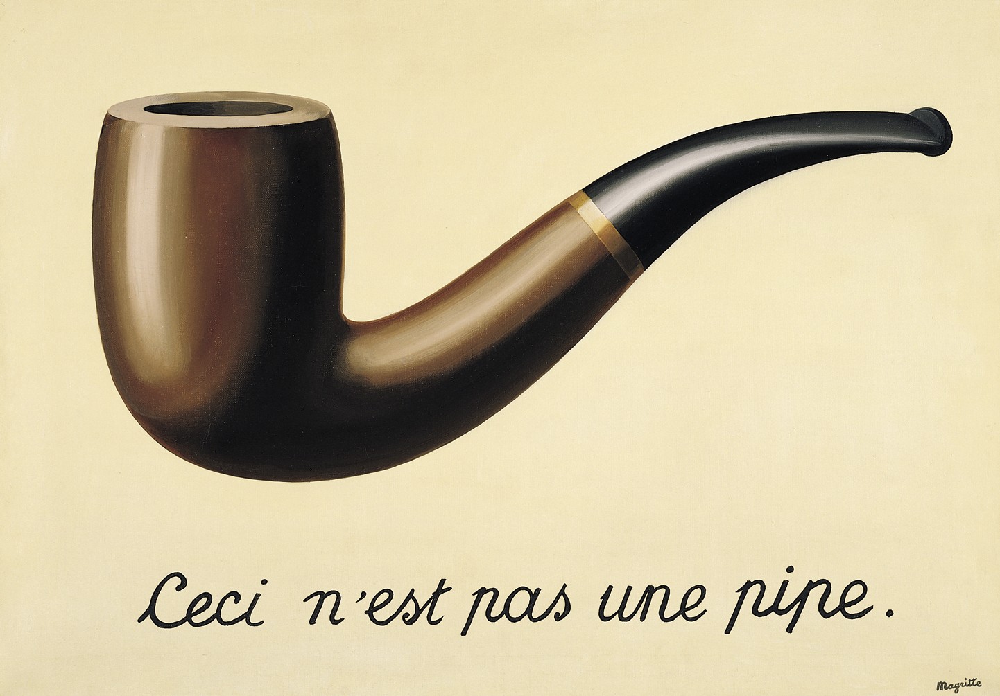
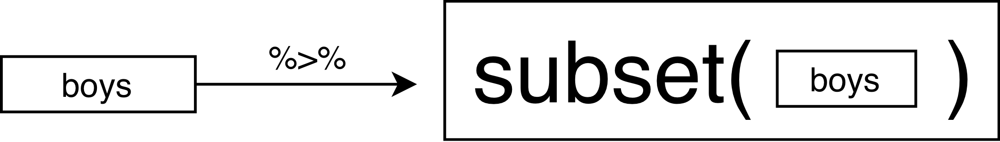
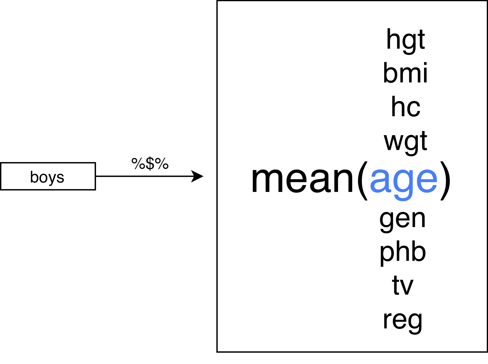

## This lecture

- Data manipulation

- Basic analysis

- Combination

- Pipes

## New packages we use
```{r warning=FALSE, message=FALSE}
library(MASS)     # for the cats data
library(dplyr)    # data manipulation
library(haven)    # in/exporting data
library(magrittr) # pipes
```

</img>

## New functions

- `transform()`: changing and adding columns
- `dplyr::filter()`: row-wise selection (of cases)
- `table()`: frequency tables
- `class()`: object class
- `levels()`: levels of a factor
- `order()`: data entries in increasing order
- `haven::read_sav()`: import SPSS data
- `cor()`: bivariate correlation
- `sample()`: drawing a sample
- `t.test()`: t-test 

# Data manipulation

## The cats data
```{r}
head(cats)
```


```{r}
str(cats)
```

## How to get only Female cats?

```{r}
fem.cats <- cats[cats$Sex == "F", ]
dim(fem.cats)
head(fem.cats)
```

## How to get only *heavy* cats?
```{r}
heavy.cats <- cats[cats$Bwt > 3, ]
dim(heavy.cats)
head(heavy.cats)
```

## How to get only *heavy* cats?
```{r}
heavy.cats <- subset(cats, Bwt > 3)
dim(heavy.cats)
head(heavy.cats)
```

## another way: `dplyr`
```{r}
filter(cats, Bwt > 2, Bwt < 2.2, Sex == "F")
```


## Working with factors
```{r}
class(cats$Sex)
levels(cats$Sex)
```

## Working with factors
```{r}
levels(cats$Sex) <- c("Female", "Male")
table(cats$Sex)
head(cats)
```

## Sorting 

```{r}
sorted.cats <- cats[order(cats$Bwt), ]
head(sorted.cats)
```


## Combining matrices or dataframes

```{r}
cats.numbers <- cbind(Weight = cats$Bwt, Height = cats$Hwt)
head(cats.numbers)
```

## Combining matrices or dataframes
```{r}
rbind(cats[1:3, ], cats[1:5, ])
```


# Basic analysis
## Correlation

```{r}
cor(cats[, -1])
```
With `[, -1]` we exclude the first column

## Correlation

```{r}
cor.test(cats$Bwt, cats$Hwt)
```

What do we conclude?

## Correlation

Makes sense, remember?

```{r fig.height=4.5, fig.width=4.5, dev.args = list(bg = 'transparent'), fig.align='center'}
plot(cats$Bwt, cats$Hwt)
```

# Pipes

## This is a pipe:

```{r message=FALSE}
boys <- 
  read_sav("boys.sav") %>%
  head()
```

It effectively replaces `head(read_sav("boys.sav"))`.


## Why are pipes useful?
Let's assume that we want to load data, change a variable, filter cases and select columns. Without a pipe, this would look like
```{r}
boys  <- read_sav("boys.sav")
boys2 <- transform(boys, hgt = hgt / 100)
boys3 <- filter(boys2, age > 15)
boys4 <- subset(boys3, select = c(hgt, wgt, bmi))
```

With the pipe:
```{r}
boys <-
  read_sav("boys.sav") %>%
  transform(hgt = hgt/100) %>%
  filter(age > 15) %>%
  subset(select = c(hgt, wgt, bmi))
```

Benefit: a single object in memory that is easy to interpret


## With pipes
Your code becomes more readable:

- data operations are structured from left-to-right and not from in-to-out
- nested function calls are avoided
- local variables and copied objects are avoided
- easy to add steps in the sequence

## What do pipes do:

- `f(x)` becomes `x %>% f()`
```{r}
rnorm(10) %>% mean()
```
- `f(x, y)` becomes `x %>% f(y)` 
```{r}
boys %>% cor(use = "pairwise.complete.obs")
```
- `h(g(f(x)))` becomes `x %>% f %>% g %>% h` 
```{r}
boys %>% subset(select = wgt) %>% na.omit() %>% max()
```

## The standard `%>%` pipe
<center>

</center>

## The `%$%` pipe
<center>

</center>

## The `%T>%` pipe
<center>

</center>

## The role of `.` in a pipe
```{r error=TRUE}
set.seed(123)
1:5 %>%
  mean() %>%
  rnorm(10) %>%
  mean()
```
VS
```{r}
set.seed(123)
1:5 %>% 
  mean() %>%
  rnorm(n = 10, mean = ., ) %>%
  mean()
```
The `.` can be used as a placeholder in the pipe. 

## Placeholder example
```{r}
set.seed(123)
1:26 %>%
  sample(3) %>%
  paste(., LETTERS[.])
```


## Performing a t-test in a pipe
```{r message=FALSE}
library(MASS) # for cats data

cats %$%
  t.test(Bwt ~ Sex)
```
is the same as 
```{r eval=FALSE}
t.test(Hwt ~ Sex, data = cats)
```

## Storing a t-test from a pipe
```{r}
cats.test <- 
  cats %$%
  t.test(Bwt ~ Sex)

cats.test
```

## Overwriting an object with a pipe
```{r}
set.seed(123)
x <- rnorm(5)
x

x %<>%
  abs()
x
```
or
```{r}
x <- x %>%
  abs()
x
```

## Useful: outlier filtering
```{r}
cats %$% mean(Hwt)

cats.outl <- 
  cats %>% 
  filter(Hwt < mean(Hwt) + 3 * sd(Hwt), 
         Hwt > mean(Hwt) - 3 * sd(Hwt))

cats %>%  
  filter(Hwt > mean(Hwt) + 3 * sd(Hwt))
```

# Practical 