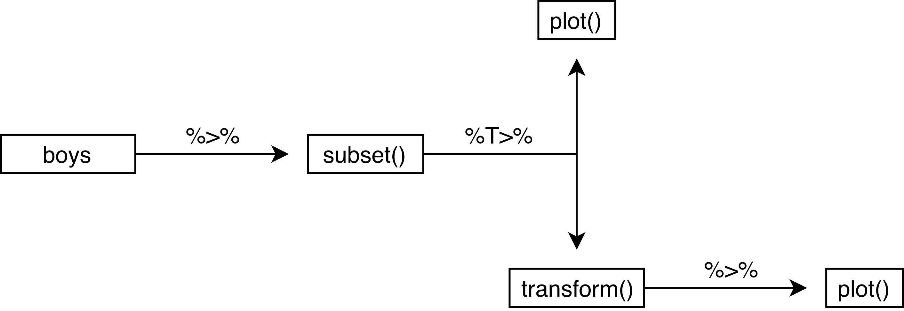

```{r echo=FALSE}
printAnswers <- TRUE

```


---

#### Exercises

---

The following packages are required for this practical:
```{r, message=FALSE}
library(dplyr)
library(magrittr)
library(mice)
```
and if you'd like the same results as I have obtained, you can fix the random seed
```{r}
set.seed(123)
```

---

1. **Use a pipe to do the following:**

- draw 1000 values from a normal distribution with `mean = 5` and `sd = 1` - $N(5, 1)$, 
- create a matrix where the first 500 values are the first column and the second 500 values are the second column **
- make a scatterplot of these two columns
```{r}
rnorm(1000, 5) %>%
  matrix(ncol = 2) %>%
  plot()
```

---

2. **Use a pipe to assign values `1:5` to object `x` and verify that the object exists.**

Normally, when we use the following code to assign values to an object, we can directly run
```{r, eval=FALSE}
x <- 1:5
```

However, when we would like to do this in a pipe, we run into a problem. 
```{r, error=TRUE}
"x" %>% assign(1:5)
x
```

The pipe creates a seperate, temporary environment where all things `%>%` take place (environments were discussed in Lecture C). This environment is different from the Global Environment and disappears once the pipe is finished. In other words, we assign `1:5` to object `x`, but once we are done assigning, object `x` is deleted. 

Function `assign()` is part of a class of functions that uses the current environment (the one that it is called from) to do its business. For such functions, we need to be explicit about the environment we would like the funtion to use:
```{r}
env <- environment()
"x" %>% assign(1:5, envir = env)
x
```
Now we have explicitly instructed function `assign()` to use the Global Environment:
```{r}
environment()
```

We could also create a new environment to assign values to objects
```{r}
assign.env <- new.env() 
"x" %>% assign(letters[1:5], envir = assign.env)
```
But then we need to call `x` from `assign.env`
```{r}
assign.env$x
```
because otherwise we would still get `x` from `R_GlobalEnv`
```{r}
x
```

---

3. **Use a pipe to calculate the correlation matrix on the `anscombe` data set**

```{r}
anscombe %>%
  cor()
```

---

4. **Now use a pipe to calculate the correlation for the pair (`x4`, `y4`) on the `anscombe` data set**

Using the standard `%>%` pipe:
```{r}
anscombe %>%
  subset(select = c(x4, y4)) %>%
  cor()
```
Alternatively, we can use the `%$%` pipe from package `magrittr` to make this process much more efficient.
```{r}
anscombe %$%
  cor(x4, y4)
```

---

5. **Use a pipe to calculate the correlation between `hgt` and `wgt` in the `boys` data set from package `mice`.**

Because `boys` has missings values for almost all variables, we must first select `wgt` and `hgt` and then omit the rows that have missing values, before we can calculate the correlation. Using the standard `%>%` pipe, this would look like:
```{r}
boys %>%
  subset(select = c("wgt", "hgt")) %>%
  cor(use = "pairwise.complete.obs")
```
which is equivalent to 
```{r}
boys %>%
  subset(select = c("wgt", "hgt")) %>%
  na.omit() %>%
  cor()
```

Alternatively, we can use the `%$%` pipe:
```{r}
boys %$% 
  cor(hgt, wgt, use = "pairwise.complete.obs")
```
The `%$%` pipe *unfolds* the listed dimensions of the `boys` dataset, such that we can refer to them directly. 

---

6. **In the `boys` data set, `hgt` is recorded in centimeters. Use a pipe to transform `hgt` in the `boys` dataset to height in meters and verify the transformation**

Using the standard `%>%` and the `%$%` pipes:
```{r}
boys %>%
  transform(hgt = hgt / 100) %$%
  mean(hgt, na.rm = TRUE)
```

---

7. **Use a pipe to plot the pair (`hgt`, `wgt`) two times: once for `hgt` in meters and once for `hgt` in centimeters. Make the points in the 'centimeter' plot `red` and in the 'meter' plot `blue`. **

This is best done with the `%T>%` pipe:
```{r}
boys %>%
  subset(select = c(hgt, wgt)) %T>%
  plot(col = "red", main = "Height in centimeters") %>%
  transform(hgt = hgt / 100) %>%
  plot(col = "blue", main = "Height in meters")
```

The `%T>%` pipe is very useful, because it creates a literal `T` junction in the pipe. It is perhaps most informative to graphically represent the above pipe as follows:
```{r eval=FALSE}
boys %>%
  subset(select = c(hgt, wgt)) %T>%
  plot(col = "red", main = "Height in centimeters") %>%
  transform(hgt = hgt / 100) %>%
  plot(col = "blue", main = "Height in meters")
```


We can see that there is indeed a literal T-junction. Naturally, we can expand this process with more `%T>%` pipes. However, once a pipe gets too long or too complicated, it is perhaps more useful to cut the piped problem into smaller, manageble pieces. 


---

End of Practical

---

#### Useful References

- [`magrittr`](https://magrittr.tidyverse.org)
- [`R` for Data Science](http://r4ds.had.co.nz) - [Chapter 18 on pipes](http://r4ds.had.co.nz/pipes.html)