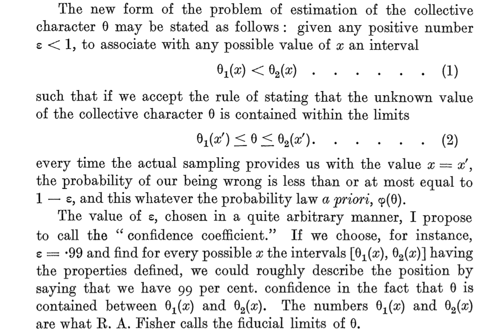

<style type="text/css">

body{ /* Normal  */
      font-size: 12px;
  }
td {  /* Table  */
  font-size: 12px;
}
h1.title {
  font-size: 18px;
  color: DarkBlue;
}
h1 { /* Header 1 */
  font-size: 18px;
}
h2 { /* Header 2 */
    font-size: 18px;
}
h3 { /* Header 3 */
  font-size: 18px;
}
code.r{ /* Code block */
    font-size: 12px;
}
pre { /* Code block - determines code spacing between lines */
    font-size: 14px;
}
</style>

---


# A review of inference concepts

# Basic concepts

## Parameters and statistics
Random sample 

- set of values drawn independently from a population

Population parameter 

- Property of the population (e.g. $\mu,\sigma,\rho$) 

Sample statistic 

- Property of the sample (e.g. $\bar{x},s,r$) 

## Sampling distributions
The sampling distribution is the distribution of a sample statistic

### Central Limit Theorem

- ***Given a distribution with mean $\mu$ and standard deviation $\sigma$, the sampling 
distribution of the mean approaches a normal distribution with mean $\mu$ and standard deviation $\frac{\sigma}{\sqrt{n}}$ as $n\to\infty$ ***

Conditions for the CLT to hold

- $\mu$ and $\sigma$ known
- the sample size $n$ is sufficiently large

# Hypothesis tests and confidence intervals

## Hypothesis tests
Statistical tests work with a null hypothesis, e.g.:
\[
H_0:\mu=\mu_0
\]

- If population parameters $\mu$ and $\sigma$ are unknown, we need to use sample mean $\bar{x}$ and sample standard deviation $s$ as estimators 
- as a consequence, the sample mean has a $t$-distribution


\[
t_{(df)}=\frac{\bar{x}-\mu_0}{SEM}
\]


## $t$-distribution
The $t$-distribution has larger variance than the normal distribution (more uncertainty). 
   
- degrees of freedom: $df=n-$ number of estimated means
- the higher the degrees of freedom (the larger the sample)
  the more it resembles a normal distribution
    
## $t$-distribution {.smaller}
```{r dev.args = list(bg = 'transparent'), fig.height=4}
curve(dt(x, 100), -3, 3, ylab = "density")
curve(dt(x,   2), -3, 3, ylab = "", add = T, col = "red")
curve(dt(x,   1), -3, 3, ylab = "", add = T, col = "blue")
legend(1.8, .4, c("t(df=100)", "t(df=2)", "t(df=1)"), 
       col = c("black", "red", "blue"), lty=1)
```

## $t$ versus normal  {.smaller}
```{r dev.args = list(bg = 'transparent'), fig.height=4}
curve(dnorm(x), -3, 3, ylab = "density")
curve(dt(x, 2), -3, 3, ylab = "", add = T, col = "red")
curve(dt(x, 1), -3, 3, ylab = "", add = T, col = "blue")
legend(1.8, .4, c("normal", "t(df=2)", "t(df=1)"), 
       col = c("black", "red", "blue"), lty=1)
```

## $p$-values
The $p$-value in this situation is the probability that $\bar{x}$ is at least that much different from $\mu_0$:

- P($\bar{X}$ $\geq$ $\bar{x}$ |$\mu$=0)

We would reject $H_0$ if $p$ is smaller than the experimenters' (that would be you) predetermined significance level $\alpha$: 

- two-sided test if $H_A:\mu\neq\mu_0$ (upper and lower ($\alpha$/2) * 100\%)
- one-sided test if $H_A:\mu>\mu_0$ or $H_A:\mu<\mu_0$ (upper or lower $\alpha$ * 100\%)

## $p$-values
Example of two-sided test for $t_{(df=10)}$ given that $P(t<-1.559)=7.5\%$ ($\alpha$ = 0.15)

```{r echo = FALSE, dev.args = list(bg = 'transparent')}
t0      <- qt(.075, 10)

cord.x1 <- c(-3, seq(-3, t0, 0.01), t0)
cord.y1 <- c(0, dt(seq(-3, t0, 0.01), 10), 0)
cord.x2 <- c(-t0, seq(-t0, 3, 0.01), 3)
cord.y2 <- c(0, dt(seq(-t0, 3, 0.01), 10), 0) 

curve(dt(x,10),xlim=c(-3,3),ylab="density",main='',xlab="t-value") 
polygon(cord.x1,cord.y1,col='red')
polygon(cord.x2,cord.y2,col='red')
```

## $p$-values: code for the figure
```{r eval = FALSE, dev.args = list(bg = 'transparent')}
t0      <- qt(.075, 10)

cord.x1 <- c(-3, seq(-3, t0, 0.01), t0)
cord.y1 <- c(0, dt(seq(-3, t0, 0.01), 10), 0)
cord.x2 <- c(-t0, seq(-t0, 3, 0.01), 3)
cord.y2 <- c(0, dt(seq(-t0, 3, 0.01), 10), 0) 

curve(dt(x,10),xlim=c(-3,3),ylab="density",main='',xlab="t-value") 
polygon(cord.x1,cord.y1,col='red')
polygon(cord.x2,cord.y2,col='red')
```

## Misconceptions {.smaller}
1. The p-value is not the probability that the null hypothesis is true or the probability that the alternative hypothesis is false. It is not connected to either. 
    
2. The p-value is not the probability that a finding is "merely a fluke." In fact, the calculation of the p-value is based on the assumption that every finding is the product of chance alone. 
    
3. The p-value is not the probability of falsely rejecting the null hypothesis. 

4. The p-value is not the probability that replicating the experiment would yield the same conclusion. 

5. The significance level, $\alpha$, is not determined by the p-value. The significance level is decided by the experimenter a-priori and compared to the p-value that is obtained a-posteriori. 

6. The p-value does not indicate the size or importance of the observed effect - they are related together with sample size. 

## 95\% confidence interval {.smaller}
*If an infinite number of samples were drawn and CI's computed, then the true population mean $\mu$ would be in* ***at least*** *95\% of these intervals*

\[
95\%~CI=\bar{x}\pm{t}_{(1-\alpha/2)}\cdot SEM
\]

Example
```{r}
x.bar <- 7.6 # sample mean
SEM   <- 2.1 # standard error of the mean
n     <- 11 # sample size
df    <- n-1 # degrees of freedom
alpha <- .15 # significance level
t.crit <- qt(1 - alpha / 2, df) # t(1 - alpha / 2) for df = 10
c(x.bar - t.crit * SEM, x.bar + t.crit * SEM) 
```

## {.smaller}
<center>

</center>

        Neyman, J. (1934). On the Two Different Aspects of the Representative Method: 
        The Method of Stratified Sampling and the Method of Purposive Selection. 
        Journal of the Royal Statistical Society, Vol. 97, No. 4 (1934), pp. 558-625

## Misconceptions {.smaller}
Confidence intervals are frequently misunderstood, even well-established researchers sometimes misinterpret them. .

1. A realised 95% CI does not mean:

- that there is a 95% probability the population parameter lies within the interval
- that there is a 95% probability that the interval covers the population parameter

    Once an experiment is done and an interval is calculated, the interval either covers, or does       not cover the parameter value. Probability is no longer involved. 

    The 95% probability only has to do with the estimation procedure. 

2. A 95% confidence interval does not mean that 95% of the sample data lie within the interval.
3. A confidence interval is not a range of plausible values for the sample mean, though it may be understood as an estimate of plausible values for the population parameter.
4. A particular confidence interval of 95% calculated from an experiment does not mean that there is a 95% probability of a sample mean from a repeat of the experiment falling within this interval.
