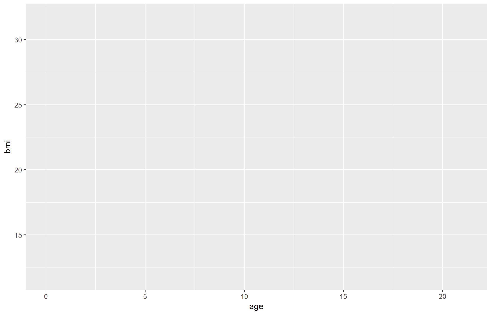
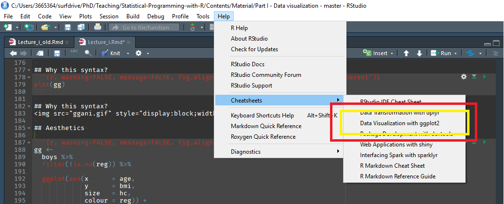

## We use the following packages
```{r, message=FALSE, warning=FALSE}
library(MASS)     # Datasets
library(mice)     # Boys dataset
library(dplyr)    # Data manipulation
library(magrittr) # Pipes
library(ggplot2)  # Plotting suite
```

##

New functions:

- `hist()`: histogram
- `plot()`: R's plotting device
- `barplot()`: bar plot function
- `boxplot()`: box plot function
- `density()`: function that calculates the density
- `ggplot()`: ggplot's plotting device


## Why visualise?

- We can process a lot of information quickly with our eyes
- Plots give us information about
    - Distribution / shape
    - Irregularities
    - Assumptions
    - Intuitions
- Summary statistics, correlations, parameters, model tests, *p*-values do not tell the whole story

### ALWAYS plot your data!


## Why visualise?

</img>
<p style="text-align:center;font-style:italic;font-size:0.5em;">Source: Anscombe, F. J. (1973). "Graphs in Statistical Analysis". American Statistician. 27 (1): 17–21.</p>


## Why visualise?

</img>


<p style="text-align:center;font-style:italic;font-size:0.5em;">Source: https://www.autodeskresearch.com/publications/samestats</p>

## What we will do

- A few plots in `base` graphics in `R`
- Plotting with `ggplot2` graphics

## Plots

```{r, echo=FALSE, fig.align='center'}
par(mfrow = c(2,2), mar = c(4, 4, 3, 1))
boys %$% hist(na.omit(hgt), main = "Histogram", xlab = "Height")
boys %$% plot(density(na.omit(hgt)), main = "Density plot", xlab = "Height", bty = "L")
boys %$% plot(hgt, wgt, main = "Scatter plot", xlab = "Height", ylab = "Weight", bty = "L")
boys %$% boxplot(hgt~reg, main = "Boxplot", xlab = "Region", ylab = "Height")
``` 

## Histogram
```{r, fig.align='center', dev.args=list(bg="transparent")}
hist(boys$hgt, main = "Histogram", xlab = "Height")
```

## Density
```{r, fig.align='center', dev.args=list(bg="transparent")}
dens <- density(boys$hgt, na.rm = TRUE)
plot(dens, main = "Density plot", xlab = "Height", bty = "L")
```

## Scatter plot
```{r, fig.align='center', dev.args=list(bg="transparent")}
plot(x = boys$hgt, y = boys$wgt, main = "Scatter plot", 
     xlab = "Height", ylab = "Weight", bty = "L")
```


## Box plot
```{r, fig.align='center', dev.args=list(bg="transparent")}
boxplot(boys$hgt ~ boys$reg, main = "Boxplot", 
        xlab = "Region", ylab = "Height")
```

<!-- ## 3d plots -->
<!-- ```{r, fig.align='center', dev.args=list(bg="transparent")} -->
<!-- persp(volcano, theta = 120) -->
<!-- ``` -->

## Box plot II

```{r, fig.align='center', dev.args=list(bg="transparent")}
boxplot(hgt ~ reg, boys,  main = "Boxplot", xlab = "Region", 
        ylab = "Height", lwd = 2, notch = TRUE, col = rainbow(5))
```

## A lot can be done in base R!

```{r dev.args=list(bg="transparent")}
boys %>% md.pattern() # from mice
```

## Many R objects have a `plot()` method

```{r, warning=FALSE, message=FALSE, fig.align='center', dev.args=list(bg="transparent")}
result <- lm(age~wgt, boys)
plot(result, which = 1)
```


## Neat! But what if we want more control?

# ggplot2

## What is `ggplot2`?
Layered plotting based on the book **The Grammer of Graphics** by Leland Wilkinsons.

With `ggplot2` you

1. provide the _data_
2. define how to map variables to _aesthetics_
3. state which _geometric object_ to display
4. (optional) edit the overall _theme_ of the plot

`ggplot2` then takes care of the details

## An example: scatterplot

1: Provide the data
```{r, eval=FALSE}
boys %>%
  ggplot()
```

2: map variable to aesthetics
```{r, eval=FALSE}
boys %>%
  ggplot(aes(x = age, y = bmi))
```

3: state which geometric object to display
```{r, eval=FALSE}
boys %>%
  ggplot(aes(x = age, y = bmi)) +
  geom_point()
```

## An example: scatterplot
```{r, echo=FALSE, fig.align='center'}
boys %>%
  ggplot(aes(x = age, y = bmi)) +
  geom_point(na.rm = TRUE)
```

## Why this syntax?

Create the plot
```{r, fig.align='center', dev.args=list(bg="transparent"), warning=FALSE, message=FALSE}
gg <- 
  boys %>%
  ggplot(aes(x = age, y = bmi)) +
  geom_point(col = "dark green")
```

Add another layer (smooth fit line)
```{r, warning=FALSE, message=FALSE, fig.align='center', dev.args=list(bg="transparent")}
gg <- gg + 
  geom_smooth(col = "dark blue")
```

Give it some labels and a nice look
```{r, fig.align='center', dev.args=list(bg="transparent")}
gg <- gg + 
  labs(x = "Age", y = "BMI", title = "BMI trend for boys") +
  theme_minimal()
```

## Why this syntax?
```{r, warning=FALSE, message=FALSE, fig.align='center', dev.args=list(bg="transparent")}
plot(gg)
```

## Why this syntax?
</img>

## Aesthetics

- x
- y
- size
- colour
- fill
- opacity (alpha)
- linetype
- ...

## Aesthetics
```{r, warning=FALSE, message=FALSE, fig.align='center', dev.args=list(bg="transparent")}
gg <- 
  boys %>% 
  filter(!is.na(reg)) %>% 
  
  ggplot(aes(x      = age, 
             y      = bmi, 
             size   = hc, 
             colour = reg)) +
  
  geom_point(alpha = 0.5) +
  
  labs(title  = "BMI trend for boys",
       x      = "Age", 
       y      = "BMI", 
       size   = "Head circumference",
       colour = "Region") +
  theme_minimal()
```
 
## Aesthetics
```{r, warning=FALSE, message=FALSE, fig.align='center', dev.args=list(bg="transparent")}
plot(gg)
```

## Geoms

- geom_point
- geom_bar
- geom_line
- geom_smooth

- geom_histogram
- geom_boxplot
- geom_density

## Geoms: Bar
```{r, echo=FALSE, warning=FALSE, message=FALSE, fig.align='center', dev.args=list(bg="transparent")}
data.frame(x = letters[1:5], y = c(1, 3, 3, 2, 1)) %>% 
  ggplot(aes(x = x, y = y)) + 
  geom_bar(fill = "dark green", stat = "identity") +
  labs(title = "Value per letter",
       x     = "Letter", 
       y     = "Value") +
  theme_minimal()
```

## Geoms: Line
```{r, echo=FALSE, warning=FALSE, message=FALSE, fig.align='center', dev.args=list(bg="transparent")}
ggdat <- data.frame(x = 1:100, y = rnorm(100))
ggdat %>% 
  ggplot(aes(x = x, y = y)) + 
  geom_line(colour = "dark green", lwd = 1) +
  ylim(-2, 3.5) +
  labs(title = "Some line thing",
       x     = "Time since start", 
       y     = "Some value") +
  theme_minimal()
```

## Geoms: Smooth
```{r, echo=FALSE, warning=FALSE, message=FALSE, fig.align='center', dev.args=list(bg="transparent")}
ggdat %>% 
  ggplot(aes(x = x, y = y)) + 
  geom_smooth(colour = "dark green", lwd = 1, se = FALSE) +
  ylim(-2, 3.5) +
  labs(title = "Some line thing",
       x     = "Time since start", 
       y     = "Some value") +
  theme_minimal()
```

## Geoms: Boxplot
```{r, echo=FALSE, warning=FALSE, message=FALSE, fig.align='center', dev.args=list(bg="transparent")}
boys %>% 
  filter(!is.na(reg)) %>% 
  
  ggplot(aes(x = reg, y = bmi, fill = reg)) +
  
  geom_boxplot() +
  
  labs(title = "BMI across regions",
       x     = "Region", 
       y     = "BMI") +
  theme_minimal() + 
  theme(legend.position = "none")
```

## Geoms: Density
```{r, echo=FALSE, warning=FALSE, message=FALSE, fig.align='center', dev.args=list(bg="transparent")}
boys %>% 
  filter(!is.na(reg)) %>% 
  ggplot(aes(x = hgt, fill = reg)) +
  geom_density(alpha = 0.5, colour = "transparent") +
  xlim(0, 250) + 
  labs(title = "Height across regions",
       x     = "Height", 
       fill  = "Region") +
  theme_minimal()
```


## Helpful link in RStudio
</img>

# Practical

