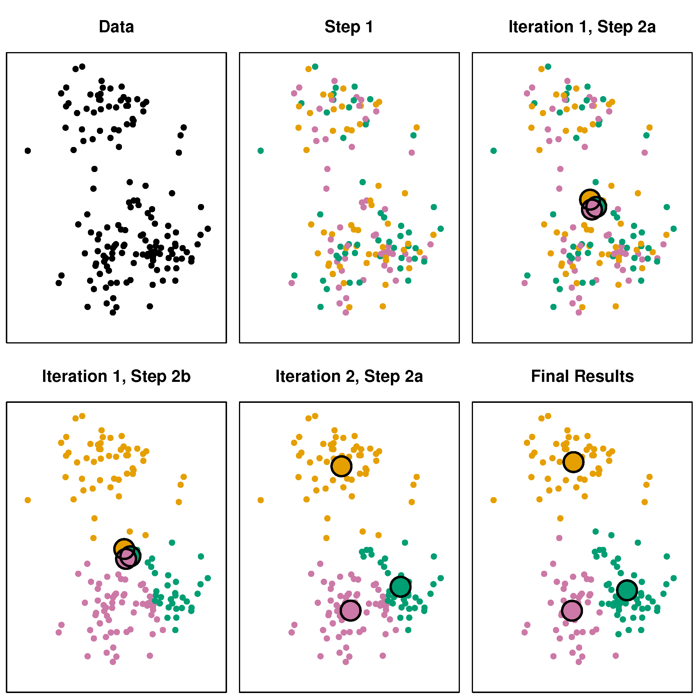

<style type="text/css">

body{ /* Normal  */
      font-size: 12px;
  }
td {  /* Table  */
  font-size: 12px;
}
h1.title {
  font-size: 18px;
  color: DarkBlue;
}
h1 { /* Header 1 */
  font-size: 18px;
}
h2 { /* Header 2 */
    font-size: 18px;
}
h3 { /* Header 3 */
  font-size: 18px;
}
code.r{ /* Code block */
    font-size: 12px;
}
pre { /* Code block - determines code spacing between lines */
    font-size: 14px;
}
</style>

---


## Packages and functions that we use
```{r message=FALSE, warning=FALSE}
library(dplyr)    # Data manipulation
library(magrittr) # Pipes
library(ggplot2)  # Plotting suite
library(MASS)     # Dataset
library(class)    # K-nearest Neighbour
library(mvtnorm)  # Multivariate Normal tools
```

### Custom theme for plots
```{r}
helpIAmColourblind <- scale_color_manual(values = c("orange", 
                                                    "blue", 
                                                    "dark green"))
```

```{r setup, include=FALSE}
theme_update(plot.background = element_rect(fill = "transparent", colour = NA))
knitr::opts_chunk$set(dev.args=list(bg="transparent"), dev = "svg")
```

# What is statistical learning?

## Statistics is everywhere

Several questions involving statistics:

1. What is the relation between $X$ and $Y$? (estimation)
2. What is the uncertainty around this effect? (estimation/inference)
3. What can I conclude about my population? (inference/hypothesis testing)

4. How can I best predict new observations? (prediction)
5. How can I show relevant patterns in my data? (dimension reduction / pattern recognition)

## Examples
- Radiologists use statistics to sharpen their images (e.g. MRI) and improve their diagnosis.
- Doctors use statistics to target your treatment to your symptoms or body.
- Physicists use statistics to find useful patterns in the huge data dumps by the Large Hadron Collider.
- Insurance companies use statistics to model risks for potential clients.
- Google uses statistics to serve you targeted ads.
- Netflix uses statistics to create hit shows.
- Spotify uses statistics to suggest music to you.

## Supervised learning
In supervised learning we aim to quantify the relation between $Y$ and $X$.

$Y$:

- target
- outcome
- dependent
- response

$X$:

- features
- predictors
- independent
- input

## Supervised learning
We want to find the predictive function:

$$Y = f(X) + \epsilon $$

That minimizes $\epsilon$ with respect to our goal.

- Function $f$ is an unknown, but fixed function of $X = X1, \dots, Xp$
- $p$ is the number of predictors
- $Y$ is the quantitative response 
- $\epsilon \sim N(0, \sigma_\epsilon^2)$ is a random error term
- $\epsilon$ does not depend on $X$

Our aim is to find the $f(X)$ that best represent the systematic information that $X$ yields about $Y$. 

## Supervised learning
With *supervised learning* every observation on our predictor 

$$x_i, i=1, \dots, n$$ 

has a corresponding outcome measurement 

$$y_i$$
such that

$$\hat{y_i}=f({\bf x_i})\quad \text{and} \quad  y_i = f({\bf x_i})+\epsilon_i.$$

Examples:

- linear regression
- logistic regression
- k-nearest neighbours classifying

## Unsupervised learning
With *unsupervised learning* we have a vector of measurement $\bf x_i$ for every unit $i=1, \dots, n$, but we miss the associated response $y_i$. 


1. There is no outcome to predict
  
    - Hence you cannot fit e.g. a linear regression model
 
2. There is no outcome to verify the model
  
    - We lack the *truth* to supervise our analysis

## What can we do?

Find patterns in $\bf x_1, \dots, x_n$

We can use this model to e.g. find out if some cases are more similar than other cases or which variables explain most of the variation

Examples:

- Principal Components Analysis
- k-means clustering

# K-means and K-nearest neighbours

## Two nonparametric algorithms

### K-nearest neighbours (KNN)

- supervised learning
- prediction
- classification
 
### K-means clustering (kmeans)

- unsupervised learning
- dimension reduction / pattern recognition
- clustering

## Example dataset
Let's create some data from a multivariate normal distribution

We start with fixing the random seed
```{r}
set.seed(123)
```

and specifying the variance covariance matrix:
```{r}
sigma <- matrix(c(1, .5, .5, 1), 2, 2)
rownames(sigma) <- colnames(sigma) <- c("x1", "x2")
```

## Data relations
```{r}
sigma
```

Because the variances are `1`, the resulting data will have a correlation of $$\rho = \frac{\text{cov}(y, x)}{\sigma_y\sigma_x} = \frac{.5}{1\times1} = .5.$$

Let's draw the data
```{r}
sim.data <- mvtnorm::rmvnorm(n     = 100, 
                             mean  = c(5, 5), 
                             sigma = sigma)
colnames(sim.data) <- c("x1", "x2")
```

## Plot the data
```{r, fig.height=4}
sim.data %>% 
  as_tibble %>%
  ggplot(aes(x1, x2)) +
  geom_point()
```

## Now add some clustering
```{r}
sim.data <- 
  sim.data %>%
  as_tibble %>%
  mutate(class = sample(c("A", "B", "C"), size = 100, replace = TRUE))
```
We have added a new column that randomly assigns rows to level `A`, `B` or `C`
```{r}
sim.data %>% head
```

## Plot the data again
```{r, fig.height=4}
sim.data %>%
  ggplot(aes(x1, x2,  colour = class)) +
  geom_point() + 
  helpIAmColourblind
```

## Adjust the clusters to make them distinct
```{r}
sim.data <- 
  sim.data %>%
  mutate(x2 = case_when(class == "A" ~ x2 + 1.5,
                        class == "B" ~ x2 - 1.5,
                        class == "C" ~ x2 + 1.5),
         x1 = case_when(class == "A" ~ x1 - 1.5,
                        class == "B" ~ x1 - 0,
                        class == "C" ~ x1 + 1.5))
```


## The result: supervised
```{r, fig.height=4}
sim.data %>%
  ggplot(aes(x1, x2,  colour = class)) +
  geom_point() + 
  helpIAmColourblind
```

## The result: unsupervised
```{r, fig.height=4}
sim.data %>%
  ggplot(aes(x1, x2)) +
  geom_point()
```

# K-Nearest Neighbors

## How does it work?

1. For every test observation $x_0$ the $K$ points that are close to $x_0$ are identified.
2. These *closest* points form set $\mathcal{N}_0$.
3. We estimate the probability for $x_0$ being part of class $j$ as the fraction of points in $\mathcal{N}_0$ for whom the response equals $j$:
$$P(Y = j | X = x_0) = \frac{1}{K}\sum_{i\in\mathcal{N}_0}I(y_i=j)$$

4. The observation $x_0$ is classified to the class with the largest probability

### In short
An observation gets that class assigned to which most of its $K$ neighbours belong

## Why KNN?

Because $X$ is assigned to the class to which most of the observations belong it is

- non-parametric

  - no assumptions about the distributions, or the shape of the decision boundary

- expected to be far better than logistic regression when decision boundaries are non-linear

However, we do not get parameters as with LDA and regression. 

- We thus cannot determine the relative importance of predictors 
- The "model" == the existing observations: instance-based learning
 
## Fitting a K-NN model
First we need to determine a training set
```{r}
set.seed(123)
sim.data <-
  sim.data %>% 
  mutate(set = sample(c("Train", "Test"), size = 100, 
                      prob = c(.25, .75), replace = TRUE))
sim.data
```

## Fitting a K-NN model
Then we split the data into a training (build the model) and a test (verify the model) set
```{r}
train.data <- subset(sim.data, set == "Train", select = c(x1, x2))
test.data <-  subset(sim.data, set == "Test",  select = c(x1, x2))
obs.class <-  subset(sim.data, set == "Train", select = class)
```

Now we can fit the K-NN model
```{r}
fit.knn <- knn(train = train.data,
               test  = test.data, 
               cl    = as.matrix(obs.class),
               k     = 3)
fit.knn
```

## Predictions
```{r}
class.test <- subset(sim.data, set == "Test", select = class) %>%
  as.matrix()
correct <- fit.knn == class.test
mean(correct)
table(fit.knn, class.test)
```

## The (in)correct responses KNN = 3
```{r, fig.height=4}
cbind(test.data, correct) %>%
  ggplot(aes(x1, x2,  colour = correct)) +
  geom_point() +
  scale_colour_manual(values = c("red", "black"))
```

## Fewer neighbours
```{r}
fit.knn <- knn(train = train.data,
               test  = test.data, 
               cl    = as.matrix(obs.class),
               k     = 2)
correct <- fit.knn == class.test
mean(correct)
table(fit.knn, class.test)
```

## More neighbours
```{r}
fit.knn <- knn(train = train.data,
               test  = test.data, 
               cl    = as.matrix(obs.class),
               k     = 4)
correct <- fit.knn == class.test
mean(correct)
table(fit.knn, class.test)
```

## Even more neighbours
```{r}
fit.knn <- knn(train = train.data,
               test = test.data, 
               cl = as.matrix(obs.class),
               k = 10)
correct <- fit.knn == class.test
mean(correct)
table(fit.knn, class.test)
```

## The (in)correct responses KNN = 10
```{r, fig.height=4}
cbind(test.data, correct) %>%
  ggplot(aes(x1, x2,  colour = correct)) +
  geom_point() +
  scale_colour_manual(values = c("red", "black"))
```

## Predicting a new observation

Let's make a new observation:

```{r}
newObs <- data.frame(x1 = 5.5, x2 = 4.5)
```

```{r, echo=FALSE}
sim.data %>%
  ggplot() +
  geom_point(aes(x1, x2,  colour = class)) + 
  geom_point(data = newObs, aes(x1, x2), size = 4, col = "black") +
  helpIAmColourblind
```

## Predicting a new observation

```{r, echo=FALSE}
sim.data %>%
  ggplot() +
  geom_point(aes(x1, x2,  colour = class)) + 
  geom_point(data = newObs, aes(x1, x2), size = 4, col = "black") +
  geom_point(data = newObs, aes(x1, x2), size = 45, pch = 21, bg = "transparent") +
  helpIAmColourblind
```

## Predicting a new observation

Now we predict the class of this new observation, using the entire data for training our model
```{r}
knn(train = sim.data[, 1:2], cl = sim.data$class, k = 10, test = newObs)
```

# K-means clustering

## Remember: unsupervised

```{r, fig.height=4}
sim.data %>%
  ggplot(aes(x1, x2)) +
  geom_point()
```

## Goal: finding clusters in our data
K-means clustering partitions our dataset into $K$ distinct, non-overlapping clusters or subgroups.

## What is a cluster?
A set of _relatively similar_ observations.

### What is "relatively similar"?
This is up to the programmer/researcher to decide. For example, we can say the "within-class" variance is as small as possible and the between-class variance as large as possible. 

## Why perform clustering? 

We expect clusters in our data, but weren't able to measure them

- potential new subtypes of cancer tissue

We want to summarise features into a categorical variable to use in further decisions/analysis

- subgrouping people by their spending types

## The k-means algorithm

1. Randomly assign values to K classes
2. Calculate the centroid (`colMeans`) for each class
3. Assign each value to its closest centroid class
4. If the assignments changed, go to step 2. else stop.

## 

</img>

<p align="center" style="font-style:italic;">Source: James, G., Witten, D., Hastie, T., & Tibshirani, R. (2013). An introduction to statistical learning (Vol. 112). New York: Springer.</p>

## The k-means algorithm

K is a __tuning parameter__ (centers)

```{r}
(fitkm <- kmeans(sim.data[, 1:2], centers = 3))
```

## The result:
```{r, fig.align='center', fig.height=4}
sim.data$clust <- as.factor(fitkm$cluster)

sim.data %>% ggplot +
  geom_point(aes(x = x1, y = x2, colour = clust)) +
  helpIAmColourblind
```

## Comparison

```{r, fig.align='center', fig.height=4}
# this is the data-generating class

sim.data %>% ggplot +
  geom_point(aes(x = x1, y = x2, colour = class)) +
  helpIAmColourblind
```

## Centroids
```{r, fig.align='center', fig.height=4}
sim.data %>% ggplot +
  geom_point(aes(x = x1, y = x2, colour = clust)) +
  geom_point(aes(x = x1, y = x2), data = as.data.frame(fitkm$centers),
             size = 5, col = "red", alpha = 0.8) +
  helpIAmColourblind
```

## K = 5
```{r, echo=FALSE, fig.align='center'}
sim.data$clust <- as.factor(kmeans(sim.data[,1:2], 5)$cluster)

sim.data %>% ggplot +
  geom_point(aes(x = x1, y = x2, colour = clust)) +
  scale_colour_manual(values = viridisLite::viridis(5))
```

## K = 2
```{r, echo=FALSE, fig.align='center'}
sim.data$clust <- as.factor(kmeans(sim.data[,1:2], 2)$cluster)

sim.data %>% ggplot +
  geom_point(aes(x = x1, y = x2, colour = clust)) +
  helpIAmColourblind
```

## Conclusion

- Supervised learning: outcome / target available
- Unsupervised learning: no outcome / target
- prediction & pattern recognition vs. estimation, inference, testing
- knn: nonparametric classification
- kmeans: clustering algorithm

- With the power of `R` we can generate any data we want and know the 'truth'!
