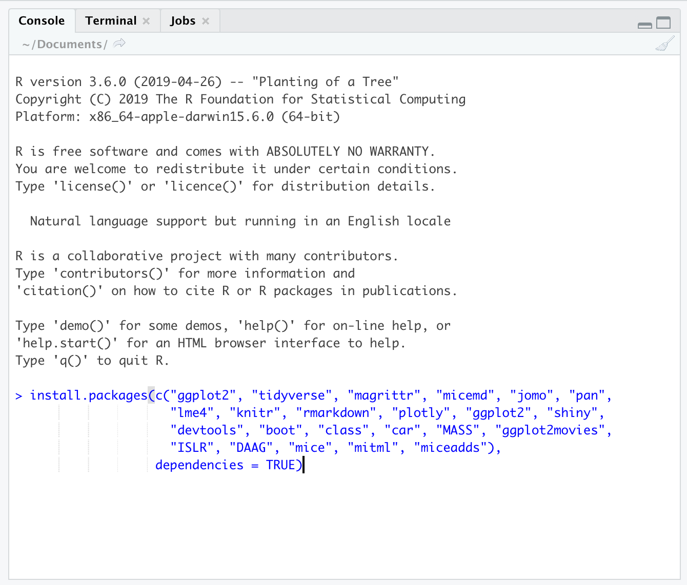

# Intro {.sidebar}

This dashboard covers a gentle introduction to `R` and `RStudio`, focusing on learning the basics __well__. 

---

Instructor: [Javier García-Bernardo](https://javier.science) <br>

The materials are adapted from the summer course given by [Gerko Vink](https://www.gerkovink.com/R/)


---

# Quick Overview

## Column 1

### Outline
R is rapidly becoming the standard platform for data manipulation, visualization and analysis and has a number of advantages over other statistical software packages. A wide community of users contribute to R, resulting in an enormous coverage of statistical procedures, including many that are not available in any other statistical program. Furthermore, it is highly flexible for programming and scripting purposes, for example when manipulating data or creating professional plots. However, R lacks standard GUI menus, as in SPSS for example, from which to choose what statistical test to perform or which graph to create. As a consequence, R is more challenging to master. Therefore, this course offers an elaborate introduction into statistical programming in R. Students learn to operate R, make plots, fit, assess and interpret a variety of basic statistical models and do advanced statistical programming and data manipulation. The topics in this course include regression models for linear, dichotomous, ordinal and multivariate data, statistical inference, statistical learning, bootstrapping and Monte Carlo simulation techniques. 

Materials covered:

##### Day 1:
- Installing R/Rstudio (done at home)
- Getting comfortable with notebooks/projects/scripts
- Getting help
- Variables in R: basic data types (character, numeric, integer, logical, date) and data structures (vectors, matrices, lists, data.frames)
- Filtering using logical operator
- Type conversion (as.integer/as.numeric/as.factor)
- Understanding/installing packages
- Reading a CSV and calculating descriptive statistics

##### Day 2:
- Control flow (if-else statements)
- For loops (for): a conceptual understanding of loops
- Functions: creating your own functions
- Principles of tidy data and short comparison of base R and the tidyverse
- Reading and writing files in several formats
- Inferential statistics: A 5-min primer of linear regression
- Best practices in R

### Daily schedule 

| Start  |  End    | What?      |
|:-------|:------|:-----------|
| 09.00 | 09.15  | Welcome |
| 09.15 | 09.45  | Lecture |
| 09:45 | 10.30  | Practical |
| 10.30 | 10.50  | Discussion |
|       | break |        |
| 11.05 | 11.45  | Lecture |
| 11:45 | 12.30  | Practical |
| 12:30 | 13.00  | Discussion |


# How to prepare

## Column 1

### Preparing your machine for the course
To realize a steeper learning curve, we will use some functionality that is not part of the base installation for `R`. The below steps guide you through installing both `R` as well as the necessary additions. 


### **System requirements**

Bring a laptop computer to the course and make sure that you have full write access and administrator rights to the machine. We will explore programming and compiling in this course. This means that you need full access to your machine. Some corporate laptops come with limited access for their users, we therefore advice you to bring a personal laptop computer, if you have one. 

### **1. Install the latest version of `R`**
`R` can be obtained [here](https://cran.r-project.org). We won't use `R` directly in the course, but rather call `R` through `RStudio`. Therefore it needs to be installed. 

### **2. Install the latest `RStudio` Desktop**

Rstudio is an Integrated Development Environment (IDE). It can be obtained as stand-alone software [here](https://www.rstudio.com/products/rstudio/download/#download). The free and open source `RStudio Desktop` version is sufficient.

### **3. Start RStudio and install the following packages. **

Execute the following lines of code in the console window:

```{r eval=FALSE, echo = TRUE}
install.packages(c("ggplot2", "tidyverse", "magrittr", "knitr", "rmarkdown", 
                   "plotly", "ggplot2", "shiny", "devtools", "boot", "class", 
                   "car", "MASS", "ggplot2movies", "ISLR", "DAAG", "mice", 
                   "purrr", "furrr", "future"), dependencies = TRUE)
```


If you are not sure where to execute code, use the following figure to identify the console - ignore the outdated version in the example:

<center>
  
</center>

Just copy and paste the installation command and press the return key. When asked 

```{r eval = FALSE, echo = TRUE}
Do you want to install from sources the package which needs 
compilation? (Yes/no/cancel)
```

type `Yes` in the console and press the return key. 

## Column 2

### **What if the steps to the left do not work for me?**
If all fails and you have insufficient rights to your machine, open a free account on [rstudio.cloud](https://rstudio.cloud). You can run your own cloud-based `RStudio` environment there. 

Naturally, you will need internet access for these services to be accessed. 


# Day 1 (Nov. 12th)

## Column 1

### Monday's materials
We adapt the course as we go. To ensure that you work with the latest iteration of the course materials, we advice all course participants to access the materials online.

- Part A: Introduction
    - [Lecture A (slides)](Contents/Material/Part A - Introduction/Lecture_A.html)
    - [Lecture A (pdf)](Contents/Material/Part A - Introduction/Lecture_A.pdf)
    - [Practical A](Contents/Material/Part A - Introduction/Practical_A_walkthrough.html)
    - [`notebook.R`](Contents/Material/Part A - Introduction/exercise_examples/notebook.R)
    - [`markdown.Rmd`](Contents/Material/Part A - Introduction/exercise_examples/markdown.Rmd)

- Part B: Working with `R`: Data types and structures
    - [Lecture B (slides)](Contents/Material/Part B - Data types and structures/Lecture_B.html)
    - [Lecture B (pdf)](Contents/Material/Part B - Data types and structures/Lecture_B.pdf)
    - [Practical B](Contents/Material/Part B - Data types and structures/Practical_B_walkthrough.html)
    - [`dataset_boys.csv`](Contents/Material/common_datasets/dataset_boys.csv)
    - [`example_csv.csv`](Contents/Material/common_datasets/example_csv.csv)

All lectures are in `html` format. Practicals are files that guide you through the exercises. Use the files without solutions unless you get stuck. Please ask questions to the instructors if something is not 100% clear.

## Column 2

### Useful references
- [The base R cheatsheet](https://github.com/rstudio/cheatsheets/raw/main/base-r.pdf)
- [The tidyverse style guide](https://style.tidyverse.org)
- [The Google R style guide](https://google.github.io/styleguide/Rguide.xml)


The above links are useful references that connect to today's materials. 

### About `rmarkdown`
<center>
<iframe src="https://player.vimeo.com/video/178485416?color=428bca&title=0&byline=0&portrait=0" width="500" height="315" frameborder="0" webkitallowfullscreen mozallowfullscreen allowfullscreen></iframe>
<p><a href="https://vimeo.com/178485416">What is R Markdown?</a> from <a href="https://vimeo.com/rstudioinc">RStudio, Inc.</a> on <a href="https://vimeo.com">Vimeo</a>.</p>
</center>

See also [this `rmarkdown` cheat sheet](Contents/Material/Part A - Introduction/rmarkdown-reference_sheet.pdf). 

<!-- # Tuesday -->

<!-- ## Column 1 -->

<!-- ### Tuesday's materials -->
<!-- We adapt the course as we go. To ensure that you work with the latest iteration of the course materials, we advice all course participants to access the materials online. -->

<!-- - Part D: Generating Data -->
<!--     - [Lecture D](Contents/Material/Part D - Data generation/Lecture_D.html) -->
<!--     - [Practical D](Contents/Material/Part D - Data generation/Practical_D_walkthrough.html) -->
<!--     - [Impractical D](Contents/Material/Part D - Data generation/Practical_D.html) -->
<!-- - Part E: Custom functions -->
<!--     - [Lecture E](Contents/Material/Part E - Functions apply and looping/Lecture_E.html) -->
<!--     - [Practical E](Contents/Material/Part E - Functions apply and looping/Practical_E_walkthrough.html) -->
<!--     - [Impractical E](Contents/Material/Part E - Functions apply and looping/Practical_E.html) -->
<!-- - Part F: Pipes -->
<!--     - [Lecture F](Contents/Material/Part F - Pipes/Lecture_F.html) -->
<!--     - [Practical F](Contents/Material/Part F - Pipes/Practical_F_walkthrough.html) -->
<!--     - [Impractical F](Contents/Material/Part F - Pipes/Practical_F.html)  -->

<!-- All lectures are in `html` format. Practicals are walkthrough files that guide you through the exercises. `Impractical` files contain the exercises, without walkthrough, explanations and solutions.  -->

<!-- ## Column 2 -->

<!-- ### Useful References -->

<!-- - [`magrittr`](https://magrittr.tidyverse.org) -->
<!-- - [`R` for Data Science](http://r4ds.had.co.nz) - [Chapter 18 on pipes](http://r4ds.had.co.nz/pipes.html) -->

<!-- The above links are useful references that connect to today's materials.  -->

<!-- # Wednesday -->

<!-- ## Column 1 -->

<!-- ### Wednesday's materials -->
<!-- We adapt the course as we go. To ensure that you work with the latest iteration of the course materials, we advice all course participants to access the materials online. -->

<!-- - Part G: Statistical models -->
<!--     - [Lecture G](Contents/Material/Part G - Statistical models/Lecture_G.html) -->
<!--     - [Practical G](Contents/Material/Part G - Statistical models/PracticalG_walkthrough.html) -->
<!--     - [Impractical G](Contents/Material/Part G - Statistical models/PracticalG.html) -->
<!-- - Part H: Statistical Inference -->
<!--     - [Lecture H](Contents/Material/Part H - Statistical inference/Lecture_H.html) -->
<!--     - [Practical H](Contents/Material/Part H - Statistical inference/PracticalH_walkthrough.html) -->
<!--     - [Impractical H](Contents/Material/Part H - Statistical inference/PracticalH.html) -->
<!--     - [A plot that demonstrates the (mis)use of Confidence Intervals](https://www.gerkovink.com/markup/Archive/2019/Wk4/Solution_to_Ex5.html) -->
<!-- - Part I: Data visualization -->
<!--     - [Lecture I](Contents/Material/Part I - Data visualization/Lecture_i.html) -->
<!--     - [Practical I](Contents/Material/Part I - Data visualization/Practical_i_walkthrough.html) -->
<!--     - [Impractical I](Contents/Material/Part I - Data visualization/Practical_i.html). -->

<!-- All lectures are in `html` format. Practicals are walkthrough files that guide you through the exercises. `Impractical` files contain the exercises, without walkthrough, explanations and solutions.  -->

<!-- ## Column 2 -->

<!-- ### Useful links -->

<!-- - [The `ggplot2` reference page](https://ggplot2.tidyverse.org/reference/) -->
<!-- - [A great reference on contrasts with linear modeling](https://rstudio-pubs-static.s3.amazonaws.com/65059_586f394d8eb84f84b1baaf56ffb6b47f.html) -->
<!-- - These papers are a nice reference for editors: -->

<!--   - [A comment in Nature from 800+ signatories](https://www.nature.com/articles/d41586-019-00857-9) -->
<!--   - [Naomi Altman and Martin Krzywinski in Nature Methods](https://www.nature.com/articles/nmeth.4120) -->
<!--   - [Statement by the Americal Statistical Association](https://www.tandfonline.com/doi/full/10.1080/00031305.2016.1154108) -->

<!-- ### Releveling -->
<!-- ```{r echo = TRUE, message=FALSE} -->
<!-- library(mice) -->
<!-- library(magrittr) -->
<!-- boys %$% lm(age ~ reg) %>% coef() -->

<!-- boys$reg <- relevel(boys$reg, ref = "south") -->
<!-- boys %$% lm(age ~ reg) %>% coef() -->
<!-- ``` -->


<!-- # Thursday -->

<!-- ## Column 1 -->

<!-- ### Thursday's materials -->
<!-- We adapt the course as we go. To ensure that you work with the latest iteration of the course materials, we advice all course participants to access the materials online. -->

<!-- - Part J: Model estimation -->
<!--     - [Lecture JK](Contents/Material/Part JK - Model estimation/Lecture_J.html) -->
<!--     - [Practical JK](Contents/Material/Part JK - Model estimation/Practical_J_walkthrough.html) -->
<!--     - [Impractical JK](Contents/Material/Part JK - Model estimation/Practical_J.html) -->
<!-- - Part K: Model estimation -->
<!--     - [Lecture JK](Contents/Material/Part JK - Model estimation/Lecture_J.html) -->
<!--     - [Practical JK](Contents/Material/Part JK - Model estimation/Practical_J_walkthrough.html) -->
<!--     - [Impractical JK](Contents/Material/Part JK - Model estimation/Practical_J.html) -->
<!-- - Part L: GLM's -->
<!--     - [Lecture L](Contents/Material/Part L - GLMs/Lecture_L.html) -->
<!--     - [The other, much longer, Lecture L](Contents/Material/Part L - GLMs/ch8_ioslides.html) -->
<!--     - [Practical L](Contents/Material/Part L - GLMs/Practical_L_walkthrough.html) -->
<!--     - [Impractical L](Contents/Material/Part L - GLMs/Practical_L.html) -->

<!-- All lectures are in `html` format. Practicals are walkthrough files that guide you through the exercises. `Impractical` files contain the exercises, without walkthrough, explanations and solutions.  -->

<!-- # Friday -->

<!-- ## Column 1 -->

<!-- ### Friday's materials -->
<!-- We adapt the course as we go. To ensure that you work with the latest iteration of the course materials, we advice all course participants to access the materials online. -->

<!-- - Part M: Classification & Clustering -->
<!--     - [Lecture M](Contents/Material/Part M - Unsupervised learning/Lecture_M.html) -->
<!--     - [Practical M](Contents/Material/Part M - Unsupervised learning/Practical_M_walkthrough.html) -->
<!--     - [Impractical M](Contents/Material/Part M - Unsupervised learning/Practical_M.html) -->
<!-- - Part N: Bootstrapping -->
<!--     - [Lecture N](Contents/Material/Part N - Bootstrapping/Lecture_N.html) -->
<!--     - [Practical N](Contents/Material/Part N - Bootstrapping/Practical_N_walkthrough.html) -->
<!--     - [Impractical N](Contents/Material/Part N - Bootstrapping/Practical_N.html) -->
<!-- - Part O: Monte Carlo simulation -->
<!--     - [Lecture O](Contents/Material/Part O - Monte carlo simulation/Lecture_O.html) -->
<!--     - [Practical O](Contents/Material/Part O - Monte carlo simulation/Practical_O_walkthrough.html) -->
<!--     - [Impractical O](Contents/Material/Part O - Monte carlo simulation/Practical_O.html) -->

<!-- All lectures are in `html` format. Practicals are walkthrough files that guide you through the exercises. `Impractical` files contain the exercises, without walkthrough, explanations and solutions.  -->


<!-- # To continue -->

<!-- ## Column 1 -->

<!-- ### What to do after the course -->

<!-- - [R for Data Science](https://r4ds.had.co.nz): a wonderful book that details a usefull toolset for current and aspiring data scientists.  -->
<!-- - [Introduction to Statistical Learning](https://www.statlearning.com): an introductory book on statistical learning, with applications in R. -->
<!-- - [Data Analysis and Graphics Using R](https://maths-people.anu.edu.au/~johnm/r-book/daagur3.html): a detailed book that covers a lot about categorical data analysis and fitting `glm`s in `R`. -->

<!-- The above references are (currently) available for free in these links. I deem them very useful and I would highly recommend them.  -->

<!-- ## Column 2 -->

<!-- ### For fun -->
<!-- <blockquote class="twitter-tweet" data-lang="en"><p lang="en" dir="ltr">My wife asked me what machine learning is and I said: remember when we ordered the hot plate for the boat and amazon suggested buying all the equipment needed to make a full meth lab?</p>&mdash; (((Kane Baccigalupi))) (@rubyghetto) <a href="https://twitter.com/rubyghetto/status/1058220004301127680?ref_src=twsrc%5Etfw">November 2, 2018</a></blockquote> -->
<!-- <script async src="https://platform.twitter.com/widgets.js" charset="utf-8"></script> -->
